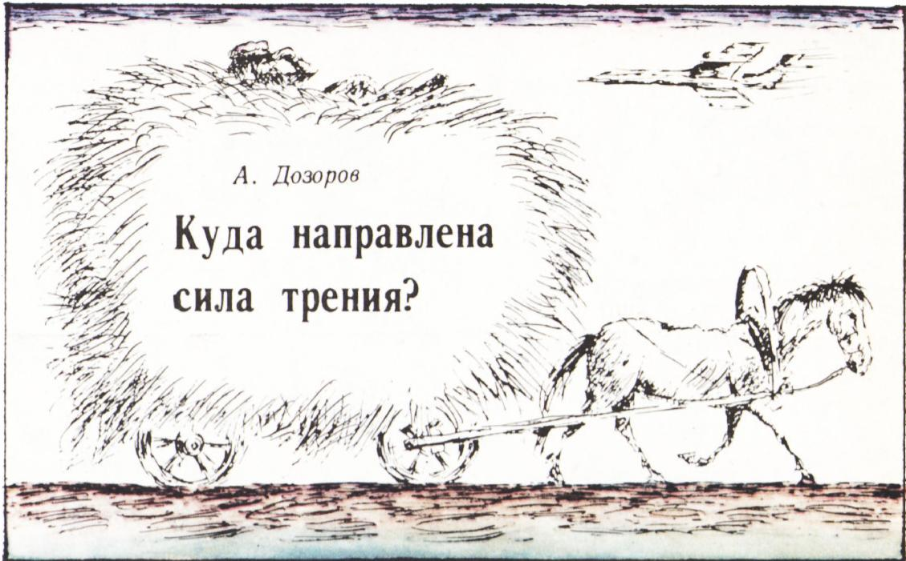
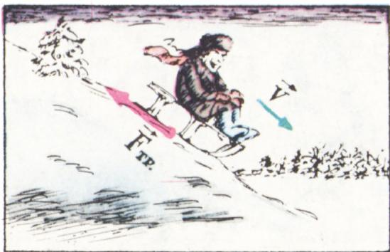
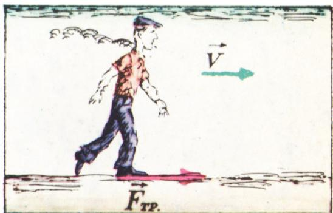
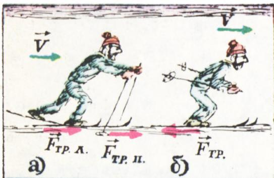
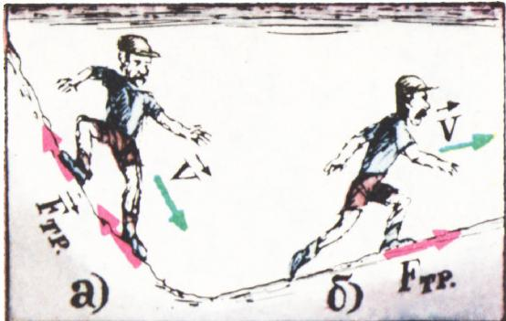
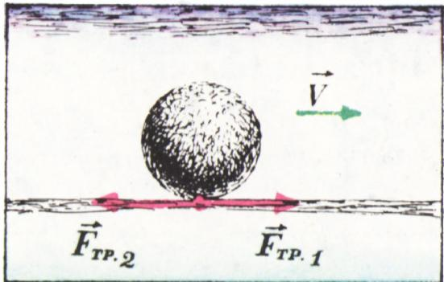

# 摩擦力指向何方？

> **原标题**：Куда направлена сила трения?
> **作者**：А. А. Дозоров（A. A. 多佐罗夫）
> **译自**：Квант 1978, № 5
> **栏目**：Квант для младших школьников（小学）
> **原文**：https://www.kvant.digital/issues/1978/5/dozorov-kuda_napravlena_sila_treniya-ebcfc311/
> **主题**：物理（摩擦力的方向）
> **难度**：★★（初中预备；需理解相对运动的概念）
> **译者**：Claude（AI 初译，2026-06）

---

如果你说摩擦力的方向与运动方向相反，这话本身没错。例如，对从山上滑下来的雪橇来说，作用在它身上的摩擦力 $F_{tr}$，方向与雪橇速度的方向相反（图 1）。但是很多时候，摩擦力会给我们带来意想不到的「惊喜」。下面就是几个例子。

一个人在平地上走路，人的速度方向朝右。摩擦力指向哪里？正确的答案是——也是朝右，也就是与人运动的方向相同，而不是相反（图 2）。不过，让我们把这个情形再仔细分析一下。当人迈步、用脚蹬地的时候，鞋底「想要」向后运动，也就是朝与人运动相反的方向运动。而地面作用在鞋底上的摩擦力，方向与鞋底运动的方向相反，也就是说朝右，正如图 2 所示。鞋底相对于地面的运动在这里起着决定性的作用——摩擦力正是与这个相对运动相抗衡。

如果摩擦力足够大，让人走路时不打滑，那么在蹬地的一瞬间，脚是不会移动的。在这种情况下，摩擦力是**静摩擦力**。要是人蹬得特别用力、或者摩擦力太小，就会开始打滑：脚底向后滑，而头还停在原地，平衡被打破，人就会摔倒。不信你试试在光滑的冰面上快步走！

<!-- OCR page: p37 -->

不过，走路的过程可不只是蹬地这一个动作。蹬地是第一步，除此之外还有另一种典型的动作：那条「落在后面」的腿被提到前面，重新落到地面上。在这种情况下，摩擦力的方向就变成与人运动的方向相反了。

由此可见，在走路时，摩擦力的方向一直在不断变化。

滑雪跑步时也是一样：当滑雪者用雪杖和雪板蹬地（图 3，а）时，摩擦力的方向是一种情况；而当他在惯性作用下继续向前滑行（图 3，б）时，方向又是另一种情况。显然，对滑雪来说，自由滑行时摩擦力越小越好；而蹬地时则不应该打滑，也就是摩擦力要尽可能大。

要做到这一点，有一个办法：比如把毛皮粘在雪板上，让绒毛的方向从雪板的前端朝向后端。在北方，人们确实使用这样的雪板。

现在我们来看一看，人在山地行走时摩擦力的方向又是怎样的。如果下坡很陡，人会用脚「刹车」，努力防止自己滚下去（图 4，а）：这时摩擦力的方向与人速度的方向相反。

如果坡度平缓，或者在登山时（图 4，б），就不需要刹车了，一切情形与在平地上走路相类似。

谈到滚动的球（图 5），摩擦力藏着的「意外」就更多了。一方面，如果球不打滑，那就意味着摩擦力足够大，能让球「蹬」地面（球受到摩擦力 $\vec{F}_{\mathrm{тр1}}$ 的作用），而且对球来说，这种「蹬地」是持续不断地发生的。

另一方面，滚动的球会越滚越慢，最后停下来。这说明，球还一直受到另一个摩擦力 $F_{тр2}$ 的作用——而且也是持续不断地作用着。对球而言，图 3 中所画的两个阶段（蹬地与惯性滑行），在这里合并成了一个。

同样的道理也适用于行驶中的汽车、火车等的轮子。

想一想：关于摩擦力的「意外」表现，你还能举出哪些例子呢？
