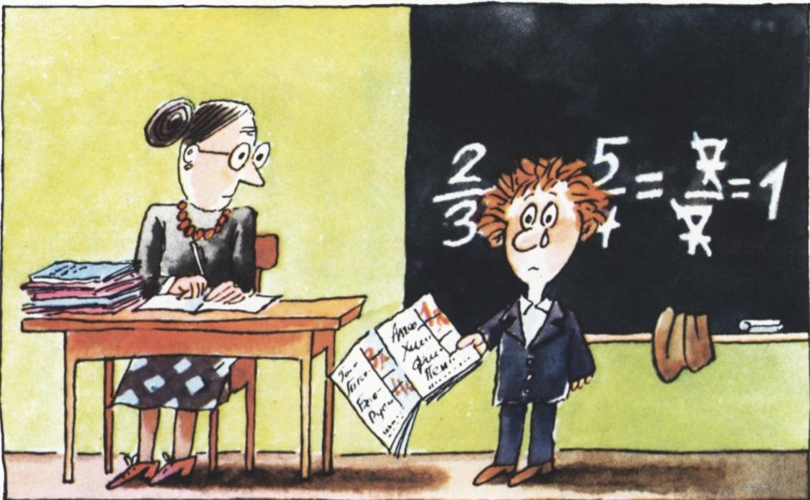

# 衍生比例

> **原标题**：Производные пропорции
> **作者**：А. Бендукидзе（本杜基泽·А. Д.）、А. Савин（萨温·А. П.）
> **译自**：Квант 1980, № 2
> **栏目**：Квант для младших школьников（小学）
> **原文**：https://www.kvant.digital/issues/1980/2/bendukidze_savin-proizvodnyie_proportsii-316ec521/
> **主题**：算术/数论（分数与比例）
> **难度**：★★（小学高年级可读，证明部分为初中预备）
> **译者**：Claude（AI 初译，2026-06）

---

## А. 本杜基泽、А. 萨温

# 衍生比例

——“你好，伊拉！”

——“啊，是你呀，维佳！进来坐。”

——“你扁桃体炎好点了吗？”

——“医生说，礼拜一就能去上学了。班里有什么新鲜事吗？”

——“今天可闹了大笑话啦！娜塔莉娅·尼古拉耶芙娜把谢廖沙·卡扎科夫叫到了黑板前。我已经不记得他做的是哪道题了，反正做到半路他要把 $\dfrac{2}{3}$ 和 $\dfrac{5}{4}$ 加起来。他倒好，把分子跟分子相加、分母跟分母相加——结果得到了 $\dfrac{7}{7}$，也就是 $1$。娜塔莉娅·尼古拉耶芙娜便说：‘谢廖沙，把日记本拿来，这个 1 分我就给你记上去，留作纪念。’

> **译者注**：俄国学校用 5 分制，1 分即最低分（不及格）。

——“等一下，维佳，这事儿可挺有意思！”

——“那可不！咱们班好久没人得过 1 分了。”

——“我说的不是这个。你瞧，一个分数比 1 小，另一个比 1 大，加起来却正好是 1。麻烦你把桌上的本子和笔递给我！谢谢。来，咱们取 $\dfrac{2}{3}$ 和 $\dfrac{2}{5}$ 看看。这样……先把分子相加，再把分母相加……”

——“你也想尝尝卡扎科夫那种‘光荣’的滋味？”

——“等等，得到的是 $\dfrac{4}{8}$，也就是 $\dfrac{2}{4}$，也就是 $\dfrac{1}{2}$。哈！$\dfrac{1}{2}$ 比 $\dfrac{2}{5}$ 大，却比 $\dfrac{2}{3}$ 小。太好啦！维佳，我发现了一条新定理：两个分数，如果把它们的分子相加、再把分母相加，所得到的新分数一定大于原来较小的那个分数，而小于原来较大的那个分数。”

——“等等，你怎么知道这条定理一定对？”

——“我现在还不知道，我只是‘感觉’它是对的。”

——“咱们来验证一下。如果两个分数本来相等，那么照你这条定理去做‘加法’，得到的应该还是和它们相等的分数。取 $\dfrac{2}{3}$ 和 $\dfrac{4}{6}$ 看看。这样……得到 $\dfrac{6}{9}$，也就是又回到了 $\dfrac{2}{3}$。”

——“干嘛非挑特殊情况呢？取一个既约分数 $\dfrac{a}{b}$ 好了。”

——“为什么一定要既约的？”

——“好吧，我把它的分子和分母同时乘上一个数 $n$。再另写一个和它相等的分数，把分子和分母同时乘上一个数 $m$。就得到

$$
\dfrac {n a}{n b} \text { 和 } \dfrac {m a}{m b}.
$$

把分子加起来、分母加起来，再相除，就得到

$$
\dfrac {n a + m a}{n b + m b}.
$$

——这下我看出来该怎么办了！分子里把 $a$ 提出来，分母里把 $b$ 提出来。写成

$$
\dfrac {a (n + m)}{b (n + m)}.
$$

现在可以把 $(n+m)$ 约掉；看得出来，得到的分数和原来那个完全相等。

——“维佳，这可也是一条漂亮的定理呢！你听这个表述：若 $\dfrac{a}{b} = \dfrac{c}{d}$，则 $\dfrac{a}{b} = \dfrac{c}{d} = \dfrac{a + c}{b + d}$。

——“我觉得这么表述更好：若 $\dfrac{a}{b} = \dfrac{c}{d}$，则

$$
\dfrac {a}{b} = \dfrac {c}{d} = \dfrac {n a + m c}{n b + m d}.
$$

礼拜一，伊拉和维佳把自己的发现拿给娜塔莉娅·尼古拉耶芙娜看。

——“不错，真棒，”娜塔莉娅·尼古拉耶芙娜说，“你们发现的这条性质当然早就为人所知了，它叫作**衍生比例**。往后你们会不止一次地用到它。当然，应该把它写进咱们的数学墙报里。伊拉，你那条定理也一起登上去：若 $\dfrac{a}{b} < \dfrac{c}{d}$，则 $\dfrac{a}{b} < \dfrac{a + c}{b + d} < \dfrac{c}{d}$。你猜得对，只是这回得由你自己来证明了。

“我自己再给你们补充几条关于衍生比例的定理。维佳，记下来。第一条定理这样写：

$$
\text{若} \ \dfrac {a}{b} = \dfrac {c}{d}, \ \text{则} \ \dfrac {a + b}{b} = \dfrac {c + d}{d}.
$$

——“哎呀，娜塔莉娅·尼古拉耶芙娜，这条太简单了！把左边逐项除以 $b$，右边逐项除以 $d$，就得到 $\dfrac{a}{b} + 1 = \dfrac{c}{d} + 1$。可是原来那两个分数就是相等的呀，所以只要在一个成立的等式两边同时加上 $1$，得到的还是成立的等式。”

——“第二条要难一点：若 $\dfrac{a}{b}=\dfrac{c}{d}$，则 $\dfrac{a}{a+b}=\dfrac{c}{c+d}$。

“第三条也记下：若 $\dfrac{a}{b} = \dfrac{c}{d}$，则 $\dfrac{a + b}{a - b} = \dfrac{c + d}{c - d}$。

——“再来一条，比例里干脆不是两个，而是四个任意的数：若 $\dfrac{a}{b} = \dfrac{c}{d}$，而 $n, m, p, r$ 是任意四个数，则

$$
\dfrac {n a + m b}{p a + r b} = \dfrac {n c + m d}{p c + r d}.
$$

——“娜塔莉娅·尼古拉耶芙娜，”伊拉说，“您前面那几条定理其实都是这条的特殊情形。在第一条里 $n, m, r$ 都取 $1$，而 $p$ 取 $0$；第二条里 $m$ 取 $0$，其余都取 $1$；第三条里 $n, m, p$ 都取 $1$，而 $r$ 取 $-1$。所以只要把这条定理证出来，其余几条就都跟着证出来了。”

——“才不是呢，”维佳慢吞吞地说，“我宁可一条一条地把这些特殊情形先看一遍，看着看着，弄明白怎么证一般情形也就水到渠成了，总比一上来就死磕那条难的强——更何况有一条我已经证出来了。”

读者朋友们，我们也邀请你们来动动脑筋，想想本文里提到的这些定理。

