# 多边形的遍历

> **原标题**：Обход многоугольника
> **作者**：Е. Бакаев（叶·巴卡耶夫）
> **译自**：Квант 2020, № 8
> **栏目**：Квант для младших школьников（小学）
> **原文**：https://www.kvant.digital/issues/2020/8/bakaev-obhod_mnogougolnika-b62ef128/
> **主题**：几何
> **难度**：★★（初中预备；需要耐心理解「外角」和不等式估算）
> **译者**：Claude（AI 初译，2026-06）

---

在 2019 年第 12 期《Kvant》举办的 А. П. 萨文纪念竞赛中，有这样一道题（题目作者是 А. Перепечко），要求对一些具体的 $n$ 求解：

> 闵豪森男爵用 $n$ 边形形状的篱笆围住了自己的领地。他声称，这个 $n$ 边形的每一个内角，要么小于 $10^{\circ}$，要么大于 $350^{\circ}$。男爵有可能没说错吗？请对 a) $n = 10$；б) $n = 11$；в) $n = 101$ 解答此题。

下面我们对一切自然数 $n$ 解这道题。我们把多边形中那些小于 $10^{\circ}$ 的角叫做**小角**，把那些大于 $350^{\circ}$ 的角叫做**大角**。于是，我们关心的多边形里有 $a$ 个小角和 $b$ 个大角，$a + b = n$。

## 偶数 n

先从最小的 $n$ 开始。显然 $n = 3$ 时这样的多边形不存在。$n = 4$ 时是有例子的（图 1，а）。再多画几个多边形，就能琢磨出对所有偶数 $n$ 都适用的例子是怎么构造的（图 1，б、в）。本节及以后，我们用紫色标出小角，用绿色标出与大角配成「完整角」的那部分。

> **练习 1**。证明在图 1,б 的六边形中成立 $\gamma = (\beta_{1} + \beta_{2}) - (\alpha_{1} + \alpha_{2} + \alpha_{3})$。

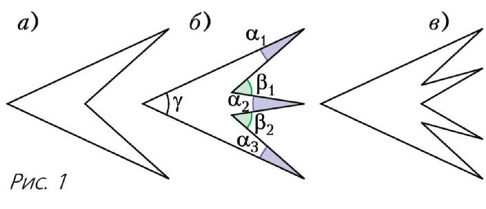
DOI: https://doi.org/10.4213/kvant20200802

和练习 1 中的情形类似，对 $(2k+2)$ 边形来说，这样的角等于

$$
\gamma = \left(\beta_ {1} + \beta_ {2} + \dots + \beta_{k}\right) - \left(\alpha_ {1} + \alpha_ {2} + \dots + \alpha_{k + 1}\right).\tag{1}
$$

这一点用「$n$ 边形内角和定理」不难证明（这定理说：任何 $n$ 边形的内角和等于 $180^{\circ} \cdot (n - 2)$）。换种看法：想象我们让最上面那条边——准确地说，是沿着边的射线方向——先逆时针转过一个角 $\alpha_{1}$，再顺时针转 $\beta_{1}$，再逆时针转 $\alpha_{2}$，如此继续（图 2）。

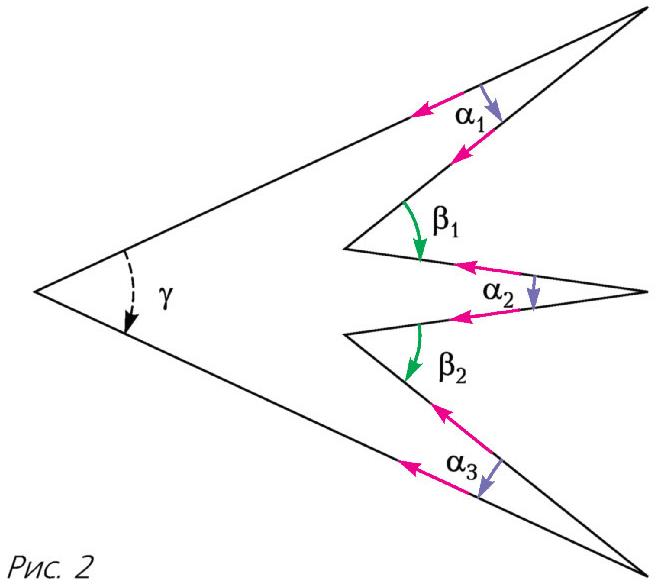

最终上面那条边会顺时针转过一个角 $\gamma$，于是我们便得到等式 (1)。

> **练习 2**。请为 $n = 6$ 和 $n = 8$ 想出与图 1 不同的例子。

## 改造法

要证明一个例子存在，也可以不把例子直接画出来：只要说明，怎样在一个合适的例子里再添两条边，使它仍然合适。这样一来，从 $n = 4$ 的一个合适例子出发，就能接连不断地造出对一切偶数 $n$ 都合适的无穷多个例子。

下面这种「改造」就行：取出多边形中的一个小角，从中挖掉一个平行四边形，如图 3 所示。一个小角会变成两个与它相等的小角和一个大角。

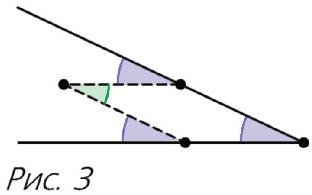

> **练习 3**。请想出另一种能给多边形添上两条边的「改造」。

所以，对边数为偶的多边形，我们已经有一系列例子了。剩下要弄清楚：对哪些奇数 $n$，也存在合适的 $n$ 边形？在所有这样的 $n$ 里取最小的一个，记作 $M$。那么对所有比 $M$ 大的奇数 $n$，只要把「改造」重复足够多次，就能得到合适的例子（同时也要确认起始的例子里至少有一个小角，好让「改造」能进行）。剩下就是求出 $M$ 了。

上面的推理里其实藏了个不严谨之处：这样的最小 $n$ 未必存在——如果对奇数 $n$ 根本就没有合适例子的话。不过我们马上就要给出一个例子。

## 第一个例子

回到图 2 的构造。当 $\gamma = 180^{\circ}$ 时，这样一个「偶数边形」就会变成「奇数边形」（图 4）。按这种方式构造，对最小的哪个 $n$ 才有例子呢？和 $\beta_{1} + \beta_{2} + \ldots + \beta_{k}$ 必须大于 $180^{\circ}$，但每一项都小于 $10^{\circ}$，所以至少要有 19 项。于是顶点总数至少是 $19 + 20 = 39$。

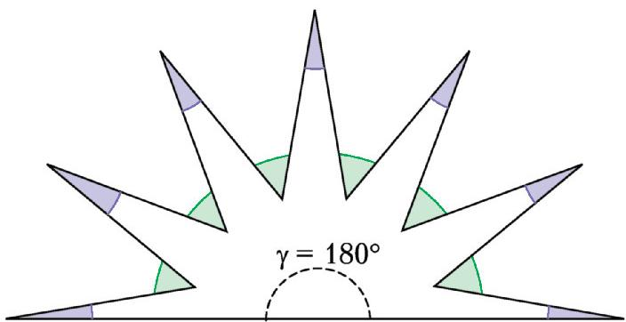
图 4

不难看出，所需的各角角度都是可以凑出来的。于是 $n = 39$ 的例子造出来了，所以 $M \leq 39$。

## 第一个估计

我们已经有了一个例子，现在来给合适多边形的边数做一个估计。我们仍像刚才那样看「方向」，但换一种看法。我们从某一处起，**逆时针**沿着多边形的边界走一圈，盯着「我们正在走的方向」是怎么变化的。

在合适的多边形里，每个角要么小、要么大，所以每走到下一条边，行进方向都几乎反过来。偶数 $n$ 的例子之所以做得出，正是因为：走一圈时方向几乎反过来的次数是偶数，最后又变回原来的方向。而对奇数 $n$，我们就得估一估这些「几乎」累积起来到底是多少。

可以把方向看成从同一点出发的一些射线。图 5,а 和图 6,а 画的是多边形的遍历；图 5,б 和图 6,б 则是把同样那些「遍历方向射线」的起点都挪到同一个点上的样子。

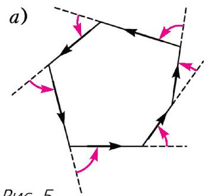
图 5

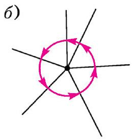

我们盯住「方向转过了多少角」。有些转向是顺时针的，有些是逆时针的。我们把逆时针方向规定为正。先随便选一个方向当作「零」，也就是计数的起点。这样一来，每一个方向都对应一个数（相对起点的偏离量），方向一变，这个数也跟着变。

走过一个小角 $\alpha_{i}$ 时，方向逆时针转 $(180^{\circ}-\alpha_{i})$（图 7,а），也就是增加 $(180^{\circ}-\alpha_{i})$。而走过

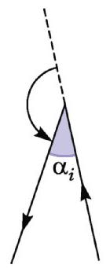
а)

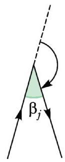
б)
图 7

一个大角 $\left(360^{\circ}-\beta_{j}\right)$ 时，方向顺时针转 $\left(180^{\circ}-\beta_{j}\right)$（图 7,б），也就是减少 $\left(180^{\circ}-\beta_{j}\right)$。所以方向的总改变量为

$$
\begin{array}{r l} S & = (1 8 0 ^ {\circ} - \alpha_ {1}) + (1 8 0 ^ {\circ} - \alpha_ {2}) + \dots + (1 8 0 ^ {\circ} - \alpha_ {a}) - \\ & - (1 8 0 ^ {\circ} - \beta_ {1}) - (1 8 0 ^ {\circ} - \beta_ {2}) - \dots - (1 8 0 ^ {\circ} - \beta_ {b}) = \\ & = 1 8 0 ^ {\circ} \cdot (a - b) - (\alpha_ {1} + \alpha_ {2} + \dots + \alpha_ {a}) + \\ & + (\beta_ {1} + \beta_ {2} + \dots + \beta_ {b}) = 1 8 0 ^ {\circ} \cdot (a - b) - A + B, \end{array} \tag {2}
$$

其中 $A$ 表示 $\left(\alpha_{1}+\alpha_{2}+\ldots+\alpha_{a}\right)$ 之和，$B$ 表示 $\left(\beta_{1}+\beta_{2}+\ldots+\beta_{b}\right)$ 之和。

因为路是闭合的，走过 $n$ 次转向后，方向会变回出发时的样子，所以方向的总改变量 $S$ 必须是 $360^{\circ}$ 的倍数。此外，$a - b \neq 0$，因为 $a + b$ 是奇数。由 (2) 式便得 $|A - B| \geq 180^{\circ}$，所以 $A$ 或 $B$ 这两个和里至少有一个含 19 项，从而 $n \geq 19$。相应地，$M \geq 19$。

## 19 的例子存在吗？

估计和例子之间，现在还差着从 19 到 39 的「缝隙」。

存在 19 个顶点的例子吗？如果存在，那从我们的估计里能看出它什么特点？$A$、$B$ 两个和里，一个含 19 项，另一个一项也没有。也就是说，所有转向都在同一个方向上（设为逆时针），且相邻两边之间的夹角平均为 $\dfrac{180^{\circ}}{19}$。我们来画这样一个多边形（图 8）。

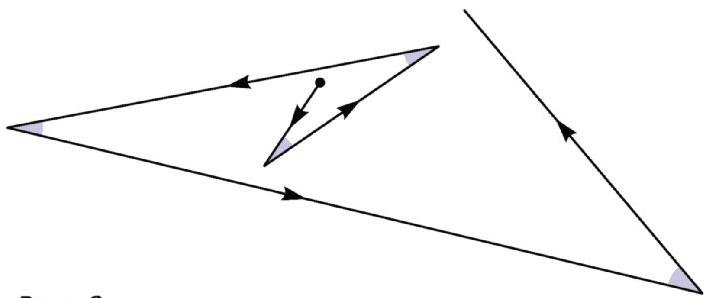
图 8

看上去我们像在「打螺旋」，要把这样一个多边形闭合起来希望不大……

在刚才的估计里，我们其实**还没用到「这是多边形」这件事**；我们只用了「这是闭合折线」这一点。提醒一下区别：按定义，多边形的边界是**不自交**的闭合折线。如果我们允许自交，能画出一条合适的、由 19 段组成的闭合折线吗？能，这样的闭合折线不难给出。看正 19 边形：从同一个顶点出发的两条最长的对角线之间，夹角正好是 $\dfrac{180^{\circ}}{19}$。所以，沿着这些对角线依次走过正 19 边形的各个顶点，就能画出一条合适的 19 段闭合折线（图 9）。

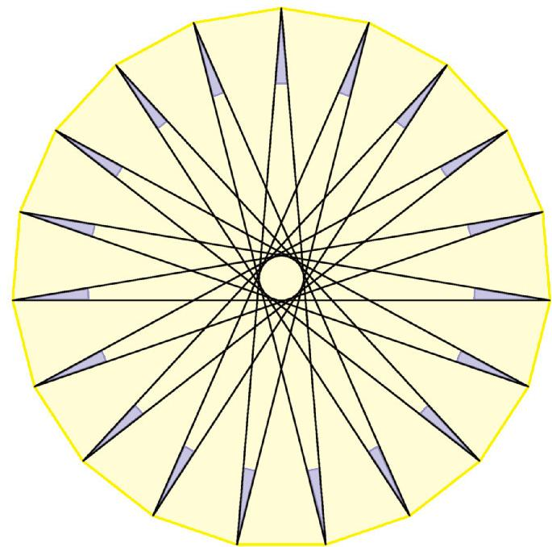
图 9

可见 $n = 19$ 时，闭合折线的例子画得出来，多边形却画不出来。

回到等式 (2)。角 $(180^{\circ}-\alpha_{i})$ 把角 $\alpha_{i}$ 补到 $180^{\circ}$，是与它**相邻**的那个角，也就是多边形的**外角**。确实，遍历方向的改变量正是这个外角的大小。对大于 $180^{\circ}$ 的角也成立：若 $\varphi > 180^{\circ}$，则 $(180^{\circ}-\varphi)$ 这个角仍可叫做与它相邻的角。只不过它的数值是负的，不过我们对负的角值已经不陌生了。图 10 用灰色标出了与角 $\varphi$ 相邻的角，分 $\varphi < 180^{\circ}$ 和 $\varphi > 180^{\circ}$ 两种情形。所以 $S$ 就是多边形**外角之和**。而对多边形（无论凸的还是非凸的），这个和等于 $360^{\circ}$！是**恰好**等于 $360^{\circ}$，而不只是像普通闭合折线那样「是 $360^{\circ}$ 的倍数」。

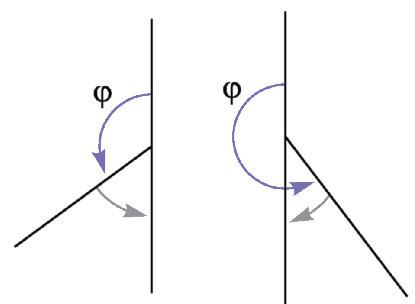
图 10

这么一来，遍历方向就**正好逆时针转了一整圈**。对凸多边形这相当显然（见图 5）。正是看这种图，可以证明「凸多边形外角和定理」（即外角和等于 $360^{\circ}$）。不过对非凸多边形，这事就一点也不显然了，证明非凸多边形的外角和（或内角和）公式用别的办法更简单。这里我们就不给出证明了。感兴趣的读者可以去看 Н. 瓦西里耶夫和 В. 古滕马赫尔的文章《角之和》与《论多边形的切割与欧拉定理》，载《Kvant》1988 年第 2 期。

## 练习

> **练习 4**。求图 9 中闭合折线的 $S$ 值。$S$ 怎样依赖于遍历方向？

> **练习 5**。举一个自交闭合折线的例子，使 а) $S = 360^{\circ}$；б) $S = 0^{\circ}$。

## 改进估计

我们已经弄清 $S = 360^{\circ}$，于是由 (2) 式得 $180^{\circ} \cdot (a - b - 2) = A - B$。因为 $0 < A < 10^{\circ} \cdot a$、$0 < B < 10^{\circ} \cdot b$，所以

$$
- 1 0 ^ {\circ} \cdot b < 1 8 0 ^ {\circ} \cdot (a - b - 2) < 1 0 ^ {\circ} \cdot a.
$$

由于 $n = a + b$ 是奇数，$a - b$ 也是奇数。我们分四种情形讨论它可能取什么值：

- $a - b \geq 5$，则 $180^{\circ} \cdot 3 < 10^{\circ} \cdot a$，即 $n \geq a \geq 55$；
- $a - b = 3$，则 $180^{\circ} < 10^{\circ} \cdot a$，即 $a \geq 19$，而 $b = a - 3 \geq 16$，所以 $n \geq 19 + 16 = 35$；
- $a - b = 1$，则 $10^{\circ} \cdot b > 180^{\circ}$，即 $b \geq 19$，而 $a = b + 1 \geq 20$，所以 $n \geq 19 + 20 = 39$；
- $a - b \leq -1$，则 $10^{\circ} \cdot b > 180^{\circ} \cdot 3$，即 $n \geq b \geq 55$。

所以一切情形下，顶点数都不小于 35：$M \geq 35$。

## 造出例子

由估计可知，$n = 35$ 这一情形只有在 $a = 19$、$b = 16$ 时才可能。这正好帮我们想出例子：4 个连在一起的小角（按遍历边界的顺序），然后一个大角，再一个小角，如此继续——小角与大角相间排列（图 11）。

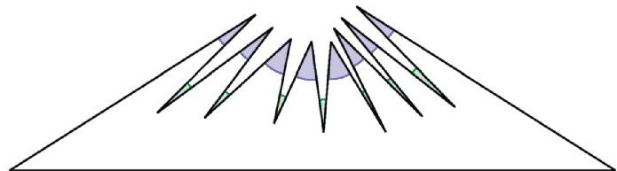
图 11

剩下要说明的是，这样构造的例子确实存在，不会撞上我们还没注意到的什么矛盾。

构造可以这样描述。取一个三角形，它的两个角都小于 $10^{\circ}$，第三个角小于 $170^{\circ}$（例如 $9^{\circ}$、$9^{\circ}$、$162^{\circ}$）。把它那个最大的角再切成 17 个小角（图 12 中画了 8 个）。这样得到一条闭合折线，其中有些线段相互重叠。它有 19 个小角和 16 个 $360^{\circ}$ 的角（图中用红色标出）。最后只需逐个挪动顶点，让各条边不再重叠，同时让小角仍然是小角。这样就得到了所要的多边形。

于是 $M = 35$。问题解决。

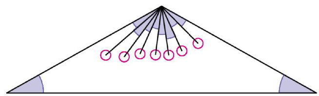

最后再给出两道与本题主题相关的有趣题目。

## 补充题

> **1**（В. Произволов，《长本领的题》）。一个 19 边形的每个角都是 $10^{\circ}$ 的整数倍。证明它一定有两条边互相平行。

> **2**。一个 $n$ 边形中，最多能有多少个锐角？а) 凸 $n$ 边形；б) 任意 $n$ 边形。

---

> **译者注**：
> 1. 原文末尾出现的「УСЛУГИ / АССОРТИМЕНТ」（服务 / 商品种类）一节是 OCR 串入的无关书店广告，与正文无关，已剔除。
> 2. 闵豪森男爵（Барон Мюнхгаузен）是俄罗斯/德国民间故事里以「吹牛大王」闻名的虚构人物，常被用来出趣味题。
> 3. А. П. 萨文是《Kvant》杂志长期的 «Квант для младших школьников» 栏目主持人，该竞赛以他命名以示纪念。
