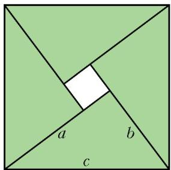
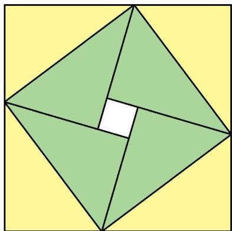
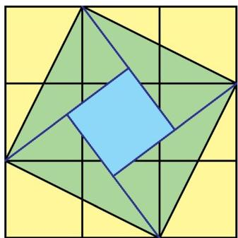
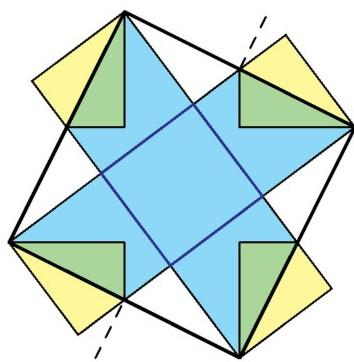
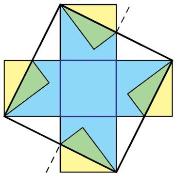
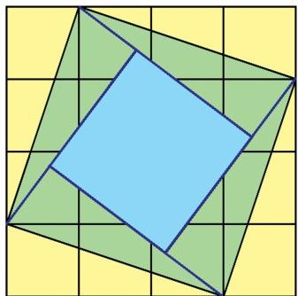
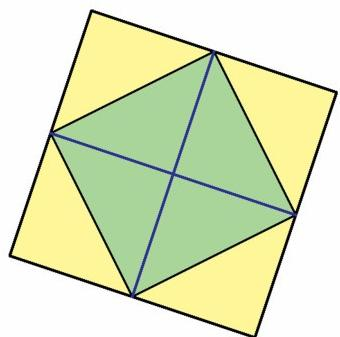
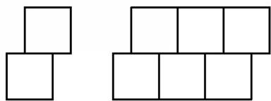

# Kvant 餐巾与毕达哥拉斯定理

> **原标题**：Салфетки «Кванта» и теорема Пифагора
> **作者**：М. Петкова（M. 彼得科娃）
> **译自**：Квант 2012, № 3
> **栏目**：Квант для младших школьников（小学）
> **原文**：https://www.kvant.digital/issues/2012/3/petkova-salfetki_kvanta_i_teorema_pifagora-4b69ecc6/
> **主题**：几何
> **难度**：★★（小学高年级可读，部分内容偏深）
> **译者**：Claude（AI 初译，2026-06）

---

不同时期，「Квант 习题栏」里出现过这样一类题目：用纸餐巾分几层盖住一张正方形的桌子。餐巾可以折叠，但不能撕开（这个要求贯穿全文）。我们来讨论一种能解决这些题目、还能顺便研究类似覆盖问题的方法。

我们先从（几乎）人人皆知的毕达哥拉斯定理讲起。这条平面几何中最重要的定理之一，看来早在公元前两千年就为人所知。如今它已有几百种不同的证法，其中不乏十分奇特的——比如有人把 20 世纪上半叶的英国数学家 G. H. 哈代的一则证明说成是用微分方程完成的。所幸我们用不上它。那么……

**毕达哥拉斯定理**。直角三角形斜边 $c$ 的平方，等于两条直角边 $a$ 与 $b$ 的平方之和：

$$
a ^ {2} + b ^ {2} = c ^ {2}.
$$

**证明**。取四块直角边为 $a>b$、斜边为 $c$ 的相同直角三角形，像图 1 那样拼成一个边长为 $c$ 的正方形。正中会留下一个边长为 $a-b$ 的方形小洞。剩下只要算面积：

$$
c ^ {2} = 4 \cdot \frac {a b}{2} + (a - b) ^ {2} = a ^ {2} + b ^ {2}.
$$

如果三角形是等腰的，中间不会出现小洞，但面积计算并不受影响。定理证毕。

不过先别急着把图 1 收起来：它会给我们解决餐巾问题的钥匙。把每一块绿色三角形沿它的斜边翻折过去。

这样会得到一个边长为 $a+b$ 的正方形，里面内接一个边长为 $c$ 的正方形。图 2 中翻折过去的三角形涂成了黄色，整张图为了方便看也转了个方向。黄色三角形的面积之和等于绿色三角形的面积之和——因为翻折不改变图形的面积。于是，内接正方形面积的 2 倍，就等于外面大正方形与中央白色小正方形的面积之和。

**练习 1**。请用代数方法证明这一事实。

现在看看，这些观察怎样帮助我们解决覆盖问题。

**题 М1755\***（В. Произволов）。有 10 块正方形餐巾，每块面积都是 1；又有一张面积是 5 的正方形桌子。证明：能用这些餐巾把桌面盖成两层。

**解**。把 9 块餐巾摆成一个 $3\times3$ 的（黄色）正方形（图 3）。在这个正方形里内接一张面积为 5 的（绿色）桌子，并把四个黄色的角折上去。中间（淡蓝色）那个小正方形的面积是 $2\cdot 5 - 9$，也就是 1。这样，除了中间的小正方形外，桌面都已经盖了两层。把第 10 块餐巾盖在中央小正方形上即可。

В. Произволов 用的是另一种摆法：他把五块餐巾摆成图 4 的样子（淡蓝色画的是餐巾正面，绿色画的是反面），把另外五块摆成图 5 的样子——图 5 是把图 4 沿虚线（穿过面积为 5 的正方形各边中点的那条线）对称翻转得到的。

把这两种摆法叠在同一张桌子上，就得到所要的覆盖。

**练习 2**（题 М1905，В. Произволов）。用 50 块 $1\times1$ 的正方形餐巾，把 $5\times5$ 的正方形桌面盖成两层，并且要求任何一块餐巾的边都不能有一段贴在桌子的边上。

**题 М1944**（В. Произволов）。面积为 5 的正方形桌子，能用 5 块面积各为 4 的正方形餐巾盖成四层。怎么盖？

**解**。把 4 块餐巾摆成一个 $4\times4$ 的正方形（图 6），在其中内接一个面积为 10 的正方形，并把四个角折起来。中间那个小正方形的面积是 $2\cdot 10 - 16$，也就是 4。在它上面放上第五块餐巾，就得到一个面积为 10、盖了两层的正方形。

把面积为 10 的这个正方形各边的中点连起来（图 7 中涂成黄色），就会围出一个面积为 5 的正方形（涂成绿色）。把黄色的角折过来，就得到所要的四层覆盖。

**练习 3**。请用图 4 来解 М1944。

**提示**。先把整组餐巾沿正方形的一条中线对折，再沿另一条中线（图 4 的虚线）对折。折之前正方形的面积是 5。两次对折后面积缩小到四分之一，于是得到一张面积为 $\dfrac{5}{4}$ 的正方形桌子，被 $1\times1$ 的餐巾盖了四层。把餐巾和桌子的边长都放大一倍即可！

目的达到了——上面列出的题目都用我们的方法解出来了。不过我们再往前走一小步。

**一般问题**。对于哪些自然数 $n$，面积是 $n$ 的正方形桌子能用 $2n$ 块面积各为 1 的正方形餐巾盖成两层？

**答**。当 $n$ 能写成 $a^{2}+b^{2}$（$a,b$ 是整数）时。

**证明**。任何一种允许的覆盖，都可以看成是用同样的餐巾在一张薄薄的方形硬纸板（大小当然和桌面一样）的正反两面各贴一层。从这个角度来想，更便于说理。

先说明：要是面积为 $n$ 的方形纸板能用 $2n$ 块面积为 1 的餐巾在正反两面贴满，那么 $n$ 一定是两个整数平方之和。分几步来证。

**第 1 步**。在贴于纸板上的那些小方形（餐巾）的边界上涂上颜料。把纸板放到平面上，让它绕着方形的边一次次「滚」过去。每当纸板贴到平面上，凡是单位小方形边界贴着平面的地方，颜料就印下来。那些被翻折的餐巾，它们边界的印迹同样凑成一个个完整的单位小方形。让这个方形朝四面八方任意多次地滚下去，会得到一幅图——单位小方形一个挨一个地铺满整个平面。我们把这样的覆盖叫做「地砖铺法」。

**第 2 步**。地砖铺法的「周期」，是指任意一个（沿某方向、移动某段距离的）平移，它把整幅铺法变回自己。按我们刚才的铺法，它有两个周期。它们是沿着原方形两条边方向的平移，移动的距离等于方形边长的 2 倍——也就是两个互相垂直方向上的平移，每个都移动 $2\sqrt{n}$。

**第 3 步**。但任何由单位小方形组成的地砖铺法，都有一个长度为 1 的周期。因为，要是两个小方形沿着边的一段互相挨着（像图 8 那样），那么往后这些直角被填满的方式是唯一的，会得到两条水平的条带（图 9）。

再看这些条带上下两边有哪些小方形接着，会发现那里也是一条条条带，依此类推。所以整幅铺法都由水平的条带组成，因而它有一个周期——水平平移 1 个单位。

如果根本找不到一对沿边一段相邻的小方形，那就得到普通的方格铺法，它甚至有两个长度为 1 的周期。

**第 4 步**。这样来建立坐标系：让上一步得到的所有条带都呈水平方向，并让坐标原点落在某个小方形的一个顶点上。于是任何小方形的任何顶点，纵坐标都是整数。把第 2 步找到的一个周期写成「向右平移 $s$、向上平移 $t$」。那么另一个周期——同样长度、但沿垂直方向——就是「向右 $t$、向下 $s$」（或「向左 $t$、向上 $s$」）。在这两个平移下，原点都必须落到某个小方形的顶点上，所以纵向位移必须是整数；由此 $s$ 和 $t$ 都是整数。

由毕达哥拉斯定理，$s^{2}+t^{2}=(2\sqrt{n})^{2}=4n$。从这个等式可知 $s$ 和 $t$ 都是偶数：$s=2a$，$t=2b$，所以 $n$ 一定能写成 $a^{2}+b^{2}$（$a,b$ 为整数），这正是我们要证的。

最后还要验证：如果 $n=a^{2}+b^{2}$（$a,b$ 为整数），那么面积为 $n$ 的方形纸板确实可以用 $2n$ 块面积为 1 的方形在正反两面贴满。这样的贴法可以照着上面的证明构造出来。取一张由单位小方形组成的普通方格铺法。既然 $n=a^{2}+b^{2}$，就可以把一块面积为 $n$ 的方形纸板放上去，让它的四个顶点都落在铺法的顶点上。这样，纸板的一面被它所压住的那部分铺法盖住，另一面则被那部分铺法翻折过来的镜像盖住。
