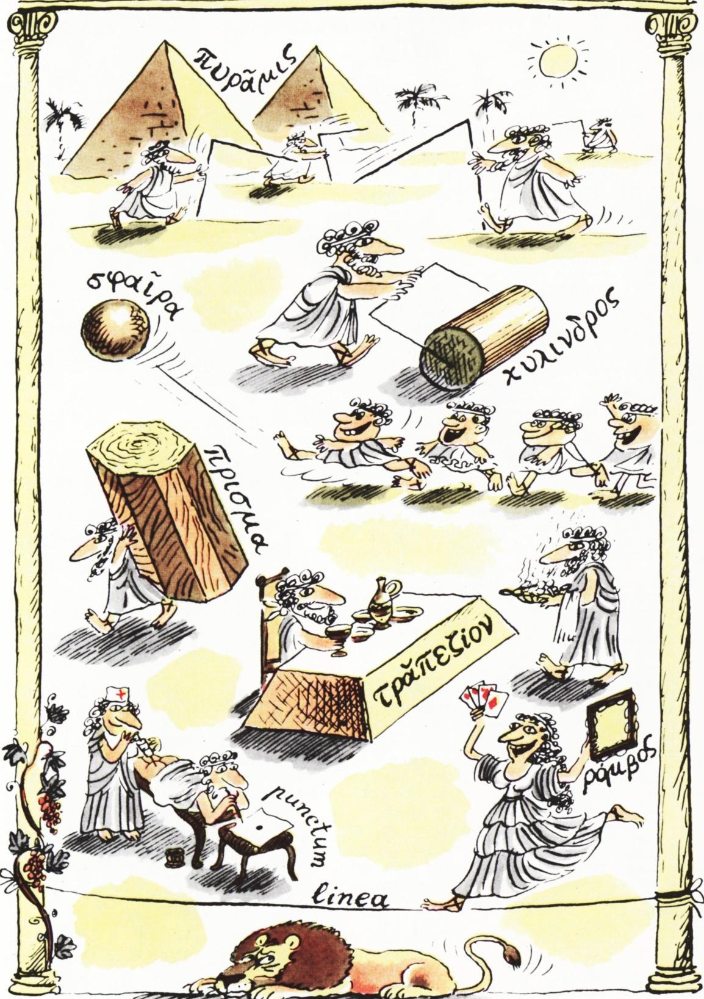

# 几何图形的名称从何而来

> **原标题**：Откуда произошли названия геометрических фигур?
> **作者**：Б. А. Розенфельд（罗森菲尔德·鲍里斯·阿布拉莫维奇）
> **译自**：Квант 1984, № 4
> **栏目**：Квант для младших школьников（小学）
> **原文**：https://www.kvant.digital/issues/1984/4/rozenfeld-otkuda_proizoshli_nazvaniya_geometricheskih_figur-e6e4a072/
> **主题**：几何
> **难度**：★（小学高年级可读）
> **译者**：Claude（AI 初译，2026-06）

---

物理数学博士 Б. А. 罗森菲尔德

几乎所有的几何图形名称都来自希腊语，「几何」这个词本身也不例外——它源自希腊词 $\gamma\varepsilon\omega\mu\varepsilon\tau\rho\acute{\iota}\alpha$（geo-metria），意思是「测地术」，也就是丈量土地。不过，这些词并不是直接从希腊语进入俄语的，而是经由拉丁语传入的。

「圆柱」（цилиндр）一词来自拉丁词 *cylindrus*（齐林德鲁斯），它是希腊词 $\kappa\acute{\upsilon}\lambda\iota\nu\delta\rho o\varsigma$（居林德罗斯）的拉丁化写法，原意是「小滚子、滚轴」。

「棱柱」（призма）一词是希腊词 $\pi\rho\acute{\iota}\sigma\mu\alpha$（普里斯马）的拉丁化形式，意思是「锯开的（东西）」——当时指的是「被锯平的圆木」。

「球面」（сфера）一词是希腊词 $\sigma\varphi\alpha\tilde{\iota}\rho\alpha$（斯法伊拉）的拉丁化形式，意思是「球、皮球」。

「角锥/金字塔」（пирамида）一词是希腊词 $\pi\upsilon\rho\alpha\mu\acute{\iota}\varsigma$（皮拉米斯）的拉丁化形式，希腊人用这个词来称呼埃及的金字塔；而这个希腊词又来自古埃及词「*pyrama*（普拉玛）」，是古埃及人自己对这些金字塔的称呼。今天的埃及人把金字塔叫作「*ahram*（阿赫拉姆）」，它同样出自这个古埃及词。

「梯形」（трапеция）一词来自拉丁词 *trapezium*（特拉佩齐乌姆），它是希腊词 $\tau\rho\alpha\pi\acute{\varepsilon}\zeta\iota o\nu$（特拉佩齐翁）的拉丁化形式，意思是「小桌子」。

我们的「就餐」（трапеза）一词也来自同一个词根，在希腊语里它的本义就是「桌子」。

「菱形」（ромб）一词来自拉丁词 *rombus*（罗姆布斯），它是希腊词 $\rho\acute{o}\mu\beta o\varsigma$（罗姆博斯）的拉丁化形式，意思是「铃鼓」。我们习惯上认为铃鼓是圆形的，但古时候的铃鼓是方形或菱形的——扑克牌上画的「铃鼓」图案就保留了这一古老形状的证据。

我们也有一些词是直接从拉丁语借来的，比如「点」（пункт，有时用以代替「точка」，由此产生「пунктир」虚线一词）和「线」（линия）。

「пункт」一词来自拉丁词 *punctum*（普恩克图姆），意思是「刺一下」；医学术语「пункция」（穿刺）也出自同一词根，意思是「扎一针」。

「линия」一词来自拉丁词 *linea*（利内阿），意思是「亚麻的」（指「亚麻线」）。我们的「linoleum」（油毡、漆布）一词也出自同一词根，它最初的意思是「涂了油的亚麻布」。

由此可见，所有几何图形的名称最初都是具体物品的名字，而这些物品的形状与对应图形或多或少有些相近。

---

> **译者注**：本文为科普词源小品，原文无数学公式。译文中所有希腊字母均按指南要求用 LaTeX 转写（如 $\gamma\varepsilon\omega\mu\varepsilon\tau\rho\acute{\iota}\alpha$、$\kappa\acute{\upsilon}\lambda\iota\nu\delta\rho o\varsigma$ 等），以还原作者所述「希腊原词」；拉丁词用斜体保留并附近似读音。
