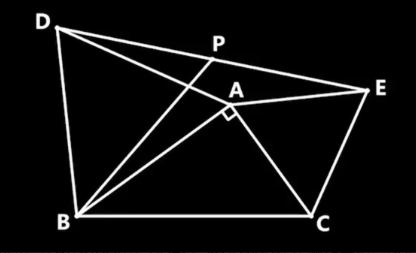

你的困惑非常深刻，它触及了代数思维的核心。在中学阶段，同一个字母在不同场景下扮演着不同角色，而你的直觉——在代数式变形时将其视为"固定但未知的数"——完全正确。以下我们先系统厘清这层关系，直接回答你的问题。

### 一、字母的三种身份

代数中的字母并非只有"变量"一种身份，它根据场景的不同，承担着三种不同的身份：

1.  **未知数（方程中）**：如 \(2x+1=5\)，\(x\) 是一个**固定但暂时未知**的数，求解即将其确定。
2.  **变量（函数中）**：如 \(y=2x+1\)，\(x\) 是**可动态变化**的量，我们关心变化规律。
3.  **任意数（代数恒等变形中）**：如 \((a+b)^2 \equiv a^2+2ab+b^2\)，\(a,b\) 代表**满足运算律的任意数**。此时，你将其感知为"固定但未知的数"或"占位符"，在操作层面正是数学家推理时的标准直觉——你并不关心它具体是谁，只基于运算律对其进行结构重组。

这里要特别澄清你纠结的那对词：**"任意"与"固定"并不矛盾**。"任意"指的是这条结论对字母的**每一个**取值都成立；而你在**操作**时，把它当作一个**不指定具体值的固定占位符**来变形。前者讲的是结论的适用范围，后者讲的是你手上的操作姿态——它们说的是同一件事。

### 二、符号约定的逻辑：任意性的层次

常见的 \(a,b,c\) 与 \(x,y,z\) 的用法差异，是一种高效的思维约定，用以区分**任意性的层次**：

-   **\(a,b,c\) 等**：通常表示**参数/常数**，是问题的"框架"。在推理中，它们虽也可任意取值，但**一经假定即被固定**，属于"背景的任意"。
-   **\(x,y,z\) 等**：通常表示**未知数/变量**，是问题的"主角"，属于"前景的待定或变化"。

这种区分如同戏剧的**舞台背景与台上演员**：背景可换，但一幕戏内固定；演员才是我们追踪其行动的对象。

要提醒的是，这套 \(a,b,c\) 与 \(x,y,z\) 的分工只是**约定俗成的习惯，而非硬性规则**；用 \(a\) 当变量、用 \(x\) 当参数都不算错。但遵守约定能让书写更易读，也让读者（包括未来的你）更快抓住谁是框架、谁是主角。

### 三、几何中的妙用：通过符号设计主动减负

几何中一个更精彩的例子，能完整展示这种层次。

当处理一个与相似三角形有关的问题时，若动点在某边上滑动，我们可这样设计符号：

-   **设某边为 \(1\)**：利用相似性消除整体尺度的冗余任意性。
-   **另两边表为 \(a, b\)**：它们成为描述**形状**的固定参数。
-   **动点相关量用 \(x, y\)**：它们表示在已定框架下真正变化的量。

这样便构建出一个清晰的、从"最不任意"到"最任意"的梯度：

> \(1\) 是基准，定尺度；\(a, b\) 是参数，定形状；\(x, y\) 是变量，描绘变化。

通过主动设计符号，我们将不同层次的任意性分配给不同类别的字母，从而让思考专注于问题的本质结构。（这套设计会在本文末尾的"第五层"里用一个具体例子真正演练一遍。）

### 小结：直接回答你的问题

回到你最初的困惑——变形时把字母看成"固定但未知的数"，到底怪不怪？

-   代数式**变形、恒等推导**时，字母是**任意数**：你在操作时把它当作一个不指定具体值的固定占位符。**你的直觉完全正确**，这正是数学家推理时的标准做法。
-   **方程**求解时，字母是**未知数**：一个固定但暂时待定的值，求解即把它确定。
-   **函数**关系中，字母才是真正的**变量**：它动态变化，我们关心的是变化规律。

所以你"分场景"的本能是对的。能对符号的用法产生这种反思，已经是走向数学通透的开始，请一定保持追问"为什么"的习惯。

---

## 进阶延伸：符号背后的逻辑骨架

> 如果你只关心开头那个"字母到底是什么"的疑问，读到这里已经足够。下面是一层更深的视角——符号之上还附着着隐形的"量词"逻辑。这部分作为延伸，了解即可，不必有压力。

真正让这一切变得复杂的，是附着在符号之上的、隐形的命题逻辑结构——特别是"对任意""存在"这些量词及其嵌套。初中的数学内容，这些量词嵌套虽然都还在一阶逻辑能描述的范围之内，但其层层叠加，已经构成了抽象思维的主要障碍。

下面我们沿着这个思路，用从简单到复杂的实例，一步步看清"隐形的逻辑结构"是如何层层叠加，最终构成抽象思维门槛的。

---

### 第一层：藏在数字算式里的"任意"

我们从最不起眼的地方开始。

**例子1**：计算 \(3 \times (4+5)\)。

你可能会说，这有什么逻辑？我直接算就完了。但当你用乘法分配律写成 \(3 \times 4 + 3 \times 5\) 时，你其实是在依赖一个隐形的全称命题：

> **"对任意三个数 a, b, c，都有 a×(b+c) = a×b + a×c。"**

你只是对这个"任意"的特例操作了一次。这里的 a, b, c 就是你之前理解的"任意数"。逻辑结构很简单：**一个全称量词管住三个字母**。

---

### 第二层：方程里的"存在"与"任意"交织

**例子2**：解一元一次方程 \(2x + 1 = 5\)。

这个简单的操作，背后其实有两个逻辑量词在工作：

-   你把 1 移到右边：\(2x = 4\)。
-   两边除以 2：\(x = 2\)。

每一步变形依赖的都是恒等变形规则，即"对任意数，等式两边同加/同乘一个数，等式仍成立"。这是**全称**。

但整个方程在问的是：**"是否存在一个数 x，使得 2x+1=5 成立？"** 这是**存在**。

于是，你用"全称规则"去服务一个"存在目标"——找出那个唯一存在的数。这就是第一次嵌套：**在全称背景下，寻找存在。**

---

### 第三层：带参数的方程——"任意"开始套"任意"

**例子3**：解关于 x 的方程 \(ax + b = 0\)（其中 a ≠ 0）。

这个方程一出现，逻辑层次立刻复杂起来：

-   你在解的，其实是这样一个命题：
    > **"对任意给定的参数 a, b（只要 a≠0），都存在唯一的 x，使得 ax+b=0 成立。"**

注意，这里量词嵌套了：先全称管住 a 和 b，再在这个框架里存在一个 x。而你的求解动作，是一次对这个嵌套结构整体的证明——你给出的公式 \(x = -b/a\)，本身就带上了"对一切 a,b 有效"的全称性。

初学时，很多同学会问："a 和 b 到底是已知还是未知？" 这个困惑，恰恰是因为我们把他们扔进了一个**全称-存在嵌套结构**里，却不告诉他们这里有量词在起作用。

---

### 第四层："若…则…"与全称量词合体——数学归纳的雏形

**例子4**：观察数列 \(1, 3, 5, 7, \dots\)，猜想前 n 个奇数的和是 \(n^2\)。

验证：

-   n=1 时，\(1 = 1^2\)，成立。
-   n=2 时，\(1+3 = 4 = 2^2\)，成立。
-   n=3 时，\(1+3+5 = 9 = 3^2\)，成立。

到这里，很多同学觉得："我验证了三个，那应该没问题了吧？" 但数学要的不是这三个，而是一个隐形的全称判断：

> **"对任意正整数 n，前 n 个奇数的和等于 n²。"**

要真正证明它，需要更高级的逻辑：假设"对某个 k 成立"，推出"对 k+1 也成立"。这个步骤的实质，是在证明另一个全称命题：

> **"对任意正整数 k，若 P(k) 成立，则 P(k+1) 成立。"**

这里，P(n) 是"前 n 个奇数之和等于 n²"。比起前几层只是量化一个数或一个等式，这里我们量化的对象变成了一个**带条件的命题**——"若 P(k) 则 P(k+1)"，结构明显更复杂。这是数学归纳法的核心，属于更高阶段（高中与竞赛）会正式学习的工具，这里只是先让你感受它的逻辑骨架。

---

### 第五层：几何动点——全称嵌套全称的完整展示

**例子5**：在任意等腰三角形 ABC（AB = AC）中，动点 P 在底边 BC 上滑动。过 P 作 PE ⊥ AB 于 E，作 PF ⊥ AC 于 F。求证：PE + PF 为定值。

**第一步：用符号分层固定任意性**

"任意等腰三角形"看着自由度很大，拆开却只有两个——底边长和腰长（等价地，底和高）。其中"整体缩放"是一个**多余的**任意性：图形整体放大缩小，并不改变"PE+PF 是否为定值"这个结论。用相似性把它剔除掉，再给剩下的量分配合适的符号：

-   **设 BC = 2**：用常数 2 锁定尺度，剔除缩放自由度（取 2 是为了让底边的一半恰为 1，对称好算）。
-   **设 AB = AC = l（\(l \ge 1\)）**：这是剩下的唯一自由参数，锁定形状。
-   **设 P 到 B 的距离为 x（\(0 \le x \le 2\)）**：这是真正变化的量，刻画动点位置。

符号层次一目了然：**2 和 1 是基准，定尺度；l 是参数，定形状；x 是变量，绘变化。**

（至于怎样把 PE、PF 各自用 x 表出、再相加得到那个不含 x 的定值——证明留给你自己完成。）

**第二步：剥开背后的逻辑结构**

题面那个"任意"，实际是一个嵌套命题：

```
对任意 等腰三角形的形状（由腰长参数 l 决定），
    对任意 动点 P 在底边上的位置 x，
        "PE + PF 为定值" 恒成立。
```

符号设计的层次，恰恰对应着量词嵌套的层次：

-   最外层全称：对一切等腰三角形的形状（l）。
-   内层全称：对底边上一切动点位置 x。
-   最终结论：一个被这些量词统摄的事实恒成立。

你之所以能"设" BC = 2、"设" P 在某个位置，是因为你在全称量词的框架下做了一个"任意取定"的逻辑动作；推理完成后，这个"设定"自然消解，结论推广回"对一切形状、对一切位置都成立"。这就是"不妨设"的逻辑本质。

---

### 进阶回顾：从简单到复杂的逻辑阶梯

回顾这五个层级，我们看到隐形的逻辑结构是如何逐层叠加的：

| 层级 | 实例 | 隐形的逻辑结构 |
| :--- | :--- | :--- |
| 1. 数字算式 | `3×(4+5)` | 单个全称（运算律） |
| 2. 简单方程 | `2x+1=5` | 全称规则 + 存在目标 |
| 3. 含参方程 | `ax+b=0` | 全称（参数）套存在（未知数） |
| 4. 归纳猜想 | 奇数和公式 | 全称套"若…则…"（量化带条件的命题） |
| 5. 几何动点 | 等腰三角形 PE+PF 为定值 | 全称套全称，符号分层固定任意性 |

这些"对任意""存在""若…则…"，很少被明确写出来，但它们恰恰是让代数从"算术"升华为"推理"的真正骨架。当你下次感到符号操作有些抽象、有些难以把握时，不妨停下来问自己一句：**"我现在是在对'所有'这样的东西说话，还是在找'某个'特殊的东西？"**

对这个问题的自觉，就是你从"会算"走向"会思"的关键一步。


---

## 实战：一道压轴题里的逻辑骨架

前面五层，我们像拆零件一样，把"对任意""存在""若…则…"一件件单独摆出来看。但真实的考题从不只考一个零件——它会把全称、存在、符号分层、转化技巧一股脑揉进一道题里。下面这道几何压轴题正是如此：表面考的是几何最值，可一旦剥到最里层，指挥整道题的，恰恰是我们刚刚讲完的那套量词骨架。

别被它吓人的外表唬住。接下来，我带你一步步把它"翻译"成熟悉的逻辑语言。

**原题**：如图，在 Rt△ABC 中，BC = 2。以 AB 为边在左侧作等边△ABD，以 AC 为边在右侧作等边△ACE，P 为 DE 的中点。求 BP 的最大值。




这道几何题，建立坐标系后，可以转化成下面这个纯粹的代数问题——而它背后的逻辑结构与原题完全一致：

**代数形式**：已知实数 \(x, y\) 满足 \(x^2 + y^2 = 1\)，求 \(5x^2 - 4xy + y^2\) 的最大值。

（原题还附带 \(x>0,\ y>0\) 的限制，这里先放一边，只聚焦最核心的结构。）

---

### 一、字母的身份与问题的逻辑结构

这里的 \(x, y\) 并非自由取值，它们被 \(x^2 + y^2 = 1\) 锁在单位圆上——我们要发问的对象，是圆上**每一个**点。

而“求最大值”是一个**存在性任务**：在全体圆上的点中，**是否存在**某个点，使目标式的值达到一个上界，并且这个上界不能被超过？

因此，整个问题的逻辑结构是：

> **全称判断**：对圆上**任意**点，目标式的值 \(\le M\)。
> **存在判断**：圆上**存在**某点，使目标式的值恰好 \(= M\)。

两个判断联合，\(M\) 才是最大值。这个逻辑骨架是整个推理的指挥棒。

---

### 二、核心思路：将“求范围”转化为“存在性判定”

令目标式等于一个参数 \(t\)：\(5x^2 - 4xy + y^2 = t\)。于是原问题等价地变成：

 \(t\) 是目标式的一个可能取值，当且仅当方程组
 \[
 \begin{cases}
 x^2 + y^2 = 1 & (1)\\
 5x^2 - 4xy + y^2 = t & (2)
 \end{cases}
 \]
 有实数解 \((x, y)\)。

道理很直白：目标式在圆上能取到多少值，恰对应多少个让方程组有解的 \(t\)。视线由此从“目标式”移到“方程组”——**给定一个 \(t\)，它到底有没有解？**

---

### 三、消元：从“点的存在性”到“斜率的存在性”

先用 (2) 减去 \(t\) 倍的 (1)，把 (2) 里那个碍事的常数项 \(t\) 消掉：

\[
(5 - t)x^2 - 4xy + (1 - t)y^2 = 0 \quad \text{(3)}
\]

这一步**可逆**：(3) 正是 \((2)-t\cdot(1)\)，反过来 \((2)=(3)+t\cdot(1)\) 立刻就能还原。所以带上 (1)，\(\{(1),(2)\}\) 与 \(\{(1),(3)\}\) 完全等价——“有没有解”，一点没变。

方程 (3) 还有个讨喜的性质：它是**齐次**的，每一项都是二次。这意味着若 \((x,y)\) 是解，它的任意倍数也是解；唯独“点在哪个方向”还没定，而“点离原点多远”已被圆 (1) 锁死。于是只剩一个自由度——点所在的斜率。令 \(m=x/y\)（两边同除以 \(y^2\)），(3) 就降成关于 \(m\) 的一元方程：

\[
(5 - t)m^2 - 4m + (1 - t) = 0 \quad \text{(4)}
\]

代换 \(m=x/y\) 不会丢解，因为它能原路退回：给定一个 \(m\)，取 \(x=my\)，再按 (1) 归一化到单位圆，原来的 \((x,y)\) 就回来了。（\(y=0\) 的两个点目标值为 \(5\)，并非最大，单独验证即可，不影响下文。）

问题至此收紧为：**方程组 (1)(2) 有实数解，等价于方程 (4) 有实数解 \(m\)。**

---

### 四、判别式：将“存在实数解”翻译为不等式

方程 (4) 是关于 \(m\) 的二次方程（\(5-t\neq0\) 时），它有没有实根，全看判别式：有实根当且仅当 \(\Delta\ge0\)。

这条”二次方程有实根 ⟺ 判别式非负”，本身就是一条全称命题——对一切实系数二次方程都成立。我们正是调用它，把”是否存在”翻译成”是否非负”。

算判别式：

\[
\Delta = (-4)^2 - 4(5-t)(1-t) = -4(t^2 - 6t + 1)
\]

\(\Delta\ge0\) 即 \(t^2-6t+1\le0\)，解得：

\[
3 - 2\sqrt{2} \le t \le 3 + 2\sqrt{2}
\]

这个区间，正是**所有能让方程组有解的 \(t\) 的集合**——也就是目标式在圆上能取到的全部值。

---

### 五、确认最大值：从“全称上界”到“存在可达”

区间的右端点 \(3+2\sqrt{2}\) 给出全称上界：**对圆上每一个点**，目标式 \(\le 3+2\sqrt{2}\)。

但“最大值”还差最后一句——这个上界得**够得着**。在 \(t=3+2\sqrt{2}\) 处判别式 \(\Delta=0\)，方程 (4) 有实根 \(m\)；而第三节已把“(4) 有实根 \(m\)”与“原方程组有解 \((x,y)\)”画上了等号，所以这个上界确实被圆上某点取到。

**全称（谁都不许超过）＋ 存在（确有人达到）＝ 最大值**。骨架合龙。

---

### 六、推理链的总览

整个思维过程，是一条等价的转化链：

1. **原问题**：“求目标式在圆上的最大值。”
2. ⇕ **参数化**：“求所有使联立方程组有实数解的 \(t\) 的范围。”
3. ⇕ **消元**：“求所有使齐次方程 (3) 与圆有交点的 \(t\)。”
4. ⇕ **降维**：“求所有使斜率方程 (4) 有实数解 \(m\) 的 \(t\)。”
5. ⇕ **代数判据**：“求所有使判别式 \(\Delta \ge 0\) 的 \(t\)。”
6. ⇕ **解不等式**：得 \(t\) 的范围，确认端点可达。

每一步的“⇕”都是双向的，因此最终得到的 \(t\) 的范围，精确地等于目标式在圆上的值域。最大值从中自然浮现。

---

### 七、与几何动点问题的对照

|  | 几何动点问题 | 本代数最值问题 |
| :--- | :--- | :--- |
| 逻辑结构 | 全称套全称 | 全称划定上界 + 存在确认可达 |
| 外层全称 | 一切形状参数 | 一切圆上的点 |
| 内层 | 一切动点位置 | 转化为斜率后，对一切可能的斜率 |
| 结论类型 | 恒等式 | 不等式（值域） |
| 核心推理 | 任意取定 → 推导 → 释放 | 参数化 → 等价转化 → 判别式判据 |

两个例子共同揭示：初中代数推理的精髓，不在于计算的繁简，而在于能否将一个问题**等价地翻译**为另一个更易处理的问题，并始终清楚每一步背后的逻辑量词在说什么。