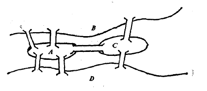

## 哥尼斯堡七桥问题
欧拉（Leonhard Euler）关于“哥尼斯堡七桥问题”的原始论文是数学史上的一座里程碑，它标志着**图论（Graph Theory）**和**拓扑学（Topology）**的诞生。

这篇论文名为《属于位置几何学的一个问题的解》（*Solutio problematis ad geometriam situs pertinentis*），于1735年向圣彼得堡科学院报告，并在1741年正式发表。

下面，我们将分为两部分来解答你的问题：首先带你回顾欧拉原始论文的面貌与他的解题思路，然后用现代图论语言将这个问题及其证明严格重现。

### 第一部分：欧拉原始论文的面貌

一个非常普遍的**历史误解**是：人们以为欧拉在论文中画出了由点和线组成的现代“图”。**事实上，欧拉的原始论文中没有任何现代意义上的“点-线”图。**

当时的哥尼斯堡有四个陆地区域（由普列戈利亚河分割）和七座桥。欧拉的解法是纯粹的**组合学和符号逻辑**，他的思路如下：

1. **符号化抽象**：
   他用大写字母 $A, B, C, D$ 代表四块陆地（其中 $A$ 代表中心的岛屿，$B, C$ 代表两岸，$D$ 代表另一块陆地）。
   他把走过一座桥的动作表示为一个字母序列。例如，从 $A$ 走到 $B$，记作 $AB$。如果走过两座桥，比如从 $A$ 到 $B$ 再到 $C$，记作 $ABC$。

2. **核心逻辑（序列长度）**：
   欧拉指出：如果一个人要走过 7 座桥，并且每座桥只走一次，那么他所经过的陆地序列中，字母的总数必须恰好是 **$7 + 1 = 8$ 个**。

3. **奇偶性分析（极其天才的一步）**：
   欧拉开始计算每个字母在这个“8字母序列”中**必须出现的次数**。
   * 假设某块陆地 $X$ 连着奇数座桥（假设为 $k$ 座）。因为每走过一座桥，字母 $X$ 要么作为起点要么作为终点被写下。为了把这 $k$ 座桥全走完，字母 $X$ 在整个序列中必须出现 $\frac{k+1}{2}$ 次。
   * 他统计了哥尼斯堡的情况：
     * $A$ 连着 5 座桥 $\rightarrow$ $A$ 必须出现 $\frac{5+1}{2} = 3$ 次。
     * $B$ 连着 3 座桥 $\rightarrow$ $B$ 必须出现 $\frac{3+1}{2} = 2$ 次。
     * $C$ 连着 3 座桥 $\rightarrow$ $C$ 必须出现 $\frac{3+1}{2} = 2$ 次。
     * $D$ 连着 3 座桥 $\rightarrow$ $D$ 必须出现 $\frac{3+1}{2} = 2$ 次。

4. **得出矛盾**：
   如果存在这样一条路径，那么 $A, B, C, D$ 出现的总次数应该是 $3 + 2 + 2 + 2 = 9$ 次。
   但是，前面已经得出，走 7 座桥的合法序列只能有 **8** 个字母。**9 > 8**，产生矛盾！因此，这样的走法绝对不存在。

5. **推广为一般定理**：
   在论文的后半部分，欧拉将其推广到任意数量的陆地和桥梁，得出了判断能否一次走完所有桥的准则（即后来的欧拉定理）。

### 第二部分：用现代数学（图论）语言重现

在现代图论中，我们抛弃了欧拉的“序列长度计数法”，而是引入了**多重图（Multigraph）**、**顶点（Vertex）**、**边（Edge）**和**度（Degree）**的概念。

#### 1. 问题的现代数学建模

* **定义图 $G$**：令 $G = (V, E)$ 是一个无向多重图。
* **顶点集 $V$**：代表陆地。$V = \{v_1, v_2, v_3, v_4\}$。
* **边集 $E$**：代表桥梁。$E = \{e_1, e_2, e_3, e_4, e_5, e_6, e_7\}$。
  由于两块陆地之间可能有多座桥，因此 $G$ 是一个多重图。具体连接关系如下：
  * $v_1$（中心岛）与 $v_2$（北岸）之间有 2 条边。
  * $v_1$（中心岛）与 $v_3$（南岸）之间有 2 条边。
  * $v_1$（中心岛）与 $v_4$（东区）之间有 1 条边。
  * $v_2$（北岸）与 $v_4$（东区）之间有 1 条边。
  * $v_3$（南岸）与 $v_4$（东区）之间有 1 条边。

#### 2. 核心数学概念定义

* **度数（Degree）**：图 $G$ 中顶点 $v$ 的度数记为 $\deg(v)$，定义为与顶点 $v$ 相连的边的数量。
* **欧拉迹（Eulerian Trail）**：在图 $G$ 中，一条经过每一条边恰好一次的迹（Trail，即不重复边的路径）。
* **欧拉回路（Eulerian Circuit）**：一条起点和终点相同的欧拉迹。

**七桥问题在现代数学中的等价表述**：
> 判断多重图 $G=(V,E)$ 中是否存在一条欧拉迹。

#### 3. 欧拉图定理的现代描述

现代图论给出了判断欧拉迹存在性的充要条件（由欧拉发现必要条件，1873年卡尔·希尔霍尔茨补全了充分条件的严格证明）：

**定理 (Euler's Theorem for Eulerian Trails):**
对于一个连通的无向多重图 $G$：
1. $G$ 存在**欧拉回路**，当且仅当 $G$ 中**所有**顶点的度数均为**偶数**。
2. $G$ 存在**欧拉迹**（但不闭合），当且仅当 $G$ 中**恰好有两个**顶点的度数为**奇数**（这两个顶点将分别是路径的起点和终点）。

#### 4. 哥尼斯堡七桥问题的现代证明

**证明：**

1. 首先，计算图 $G$ 中各个顶点的度数：
   * $\deg(v_1) = 2 + 2 + 1 = 5$ （奇数）
   * $\deg(v_2) = 2 + 1 = 3$ （奇数）
   * $\deg(v_3) = 2 + 1 = 3$ （奇数）
   * $\deg(v_4) = 1 + 1 + 1 = 3$ （奇数）

2. 考察图 $G$ 的度数序列： $(5, 3, 3, 3)$。

3. 我们发现，图 $G$ 中度数为奇数的顶点个数为 $4$ 个。

4. 根据欧拉迹的定理，一个连通图存在欧拉迹的必要条件是：奇数度的顶点个数必须等于 $0$ 或 $2$。

5. 因为 $4 \notin \{0, 2\}$，所以该图不存在欧拉迹。

**结论**：哥尼斯堡七桥问题无解。$\blacksquare$

### 总结

欧拉的原始论文伟大之处在于，他剥离了问题中关于距离、方向、桥的长短等**几何（定量）特征**，只保留了连接关系的**拓扑（定性）特征**。

虽然他没有画出现代的图模型，但他用符号序列寻找奇偶矛盾的方法，其内在逻辑与现代计算顶点度数的做法是完全等价的。现代数学语言用集合论和图论概念，把欧拉那套略显复杂的“序列长度与字母频次计算”，提炼成了极其优美、简洁的“度数奇偶性”定理。

## 欧拉图定理证明

欧拉图定理（Euler's Theorem for Eulerian Trails）是图论中最基础、最优雅的定理之一。它的证明逻辑非常清晰，通常被分为两部分：**欧拉回路（闭合路径）的证明** 和 **欧拉迹（开放路径）的证明**。

在数学中，这是一个“当且仅当”（充要条件）的定理，因此我们需要对每个部分进行**双向证明**：即证明“必要性”（如果有这样的路径，度数必定如何）和“充分性”（如果度数满足条件，必定有这样的路径）。

### 准备工作：明确前提
设 $G = (V, E)$ 是一个**连通的**无向多重图（连通意味着任何两个顶点之间都有路径相连，孤立的、没有边的顶点我们忽略不计）。

### 第一部分：欧拉回路的证明

**定理 1：** 连通图 $G$ 存在欧拉回路 $\iff$ $G$ 中**所有**顶点的度数均为**偶数**。

#### 1. 证明必要性 ($\implies$)
**已知**：图 $G$ 存在一条欧拉回路。
**求证**：所有顶点的度数为偶数。

**证明过程**：
1. 假设有一名旅行者沿着这条欧拉回路行走。
2. 因为是回路，旅行者从某个起点出发，最终会回到该起点，且在此过程中，图中的**每一条边都恰好被走过一次**。
3. 考察任意一个顶点 $v$：
   - 每次旅行者**进入**顶点 $v$，他都必须通过另一条边**离开**顶点 $v$（哪怕 $v$ 是起点，出发算作离开，最后结束算作进入）。
   - 也就是说，进入和离开的动作总是“成对”出现的。
   - 每发生一次“进入-离开”的过程，就会消耗掉与顶点 $v$ 相连的 **2 条边**。
4. 因为欧拉回路走遍了图中的所有边，所以与顶点 $v$ 相连的所有边都能被完美地分成两两一对。
5. 因此，与任意顶点 $v$ 相连的边数（即度数）必定是 2 的倍数，即**偶数**。 

#### 2. 证明充分性 ($\impliedby$)
**已知**：图 $G$ 中所有顶点的度数均为偶数，且 $G$ 连通。
**求证**：图 $G$ 存在欧拉回路。

**证明过程**（构造法/Hierholzer算法思想）：
1. **寻找初始回路**：
   - 从任意一个顶点 $v_0$ 出发，随意沿着未走过的边行走。
   - 因为所有顶点的度数都是偶数，所以每当你进入一个顶点 $u$（$u \neq v_0$），由于你已经消耗了奇数条与 $u$ 相连的边，而 $u$ 的总度数是偶数，这就意味着**必定至少还有一条未走过的边可以让你离开 $u$**。你永远不会在非起点的顶点“卡死”。
   - 因为图的边数是有限的，这种走法最终必定会回到起点 $v_0$，从而形成一个闭合的回路，我们记作 $C_1$。
2. **判断与剔除**：
   - 如果 $C_1$ 包含了 $G$ 中的所有边，那么 $C_1$ 就是我们要找的欧拉回路，证明结束。
   - 如果 $C_1$ 没有包含所有的边，我们就从图 $G$ 中**删掉** $C_1$ 经过的所有边，得到一个新的子图 $G'$。
3. **递归合并**：
   - 在回路 $C_1$ 中，每个顶点被消耗的度数必然是偶数（进入一次离开一次）。因此，在剩下的子图 $G'$ 中，所有顶点的度数**依然全为偶数**。
   - 因为原图 $G$ 是连通的，所以剩下的子图 $G'$ 必定与回路 $C_1$ 至少有一个公共顶点，设为 $w$。
   - 我们从公共顶点 $w$ 出发，在子图 $G'$ 中重复步骤 1，必然能找到一个新回路 $C_2$。
   - 我们将 $C_2$ **缝合**到 $C_1$ 中：即从 $v_0$ 出发沿着 $C_1$ 走到 $w$，然后走完整个 $C_2$ 回到 $w$，再继续走完 $C_1$ 剩下的部分。这就形成了一个更大的回路。
4. 不断重复上述“寻找新回路并缝合”的过程，因为图的边数有限，最终必然能把所有的边都缝合进一个大回路中。这个大回路就是图 $G$ 的欧拉回路。 

### 第二部分：欧拉迹（不闭合）的证明

有了第一部分的基础，第二部分的证明运用了一个极其巧妙的数学技巧：**添加辅助线（转化法）**。

**定理 2：** 连通图 $G$ 存在欧拉迹（起点与终点不同） $\iff$ $G$ 中**恰好有两个**顶点的度数为**奇数**。

#### 1. 证明必要性 ($\implies$)
**已知**：图 $G$ 存在一条不闭合的欧拉迹，设起点为 $A$，终点为 $B$。
**求证**：只有 $A$ 和 $B$ 的度数为奇数，其余全为偶数。

**证明过程**：
1. 考虑欧拉迹路径上的中间顶点（即除了 $A$ 和 $B$ 之外的任意顶点 $v$）。
2. 对于任意中间顶点 $v$，旅行者每次经过它，都是“一进一出”，消耗 2 条边。所以中间顶点的度数全为**偶数**。
3. 对于起点 $A$：旅行者从 $A$ 离开的次数比进入 $A$ 的次数多 1 次。因此 $A$ 的度数是**奇数**。
4. 对于终点 $B$：旅行者进入 $B$ 的次数比离开 $B$ 的次数多 1 次。因此 $B$ 的度数是**奇数**。
5. 结论成立：恰好有两个奇数度顶点。

#### 2. 证明充分性 ($\impliedby$)
**已知**：图 $G$ 中恰好有两个奇数度的顶点，设为 $A$ 和 $B$。其余顶点度数全为偶数。
**求证**：图 $G$ 存在从 $A$ 到 $B$ 的欧拉迹。

**证明过程**：
1. **构造新图**：我们在原图 $G$ 的基础上，人为地添加一条“虚拟边” $e^*$，连接顶点 $A$ 和 $B$。我们将这个新图记为 $G^*$。
2. **利用定理 1**：在图 $G^*$ 中，顶点 $A$ 和 $B$ 各增加了一条相连的边。因为它们原本的度数是奇数，奇数+1=偶数。此时，图 $G^*$ 中**所有**顶点的度数都变成了偶数。
3. 根据前面的【定理 1】，由于 $G^*$ 连通且所有顶点度数为偶数，图 $G^*$ 必定存在一条**欧拉回路** $C^*$。
4. **还原原图**：在这条欧拉回路 $C^*$ 中，必定在某个时刻经过了那条虚拟边 $e^*$。
5. 我们只需将这根虚拟边 $e^*$ 从回路 $C^*$ 中**剪断并移除**。
6. 闭合的圈被剪断一条边后，就变成了一条两端不相交的“线段”（开放路径）。这条路径的两个端点恰好是 $A$ 和 $B$。
7. 因为我们只是移除了虚拟边 $e^*$，原图 $G$ 中的所有边依然被完美地走了一次。这就构成了原图 $G$ 中一条从 $A$（或 $B$）出发，到 $B$（或 $A$）结束的欧拉迹。

$\blacksquare$（证明完毕）

### 总结
现代图论对于欧拉定理的证明展示了数学中两种非常强大的思想：
1. **算法构造思想**（充分性证明1）：不只是告诉你存在，而是给出一套步骤（Hierholzer算法），照着做必定能把这条路找出来。
2. **问题转化思想**（第二部分证明）：通过添加一条“虚拟边”，将一个未知问题（欧拉迹）完美转化为一个已解决的问题（欧拉回路），四两拨千斤地完成了证明。

## N点一笔画最大边数

要回答“N个点的一笔画问题，最多可以有多少条连线（边）”，我们首先必须确立一个基本前提：**我们讨论的是“简单图”**（即任意两个点之间最多只有一条连线，且没有自己连向自己的环）。如果允许两点间有多条线，那答案将是无穷大，问题也就失去了意义。

在“简单图”的前提下，这个问题的答案取决于 **$N$ 的奇偶性**。

先给出结论：
1. **当 $N$ 为奇数时（或 $N=2$ 时）**，最多连线数为完全图的边数：**$\frac{N(N-1)}{2}$** 条。
2. **当 $N$ 为偶数且 $N \ge 4$ 时**，最多连线数为：**$\frac{N^2 - 2N + 2}{2}$** 条（或者写为 $\frac{N(N-1)}{2} - \frac{N-2}{2}$）。

下面是严谨的推导与证明过程：

### 第一步：回顾一笔画（欧拉迹）定理
正如我们在七桥问题中所知，一个连通图能够“一笔画”的充要条件是：
* **奇数度的顶点个数只能是 0 个，或者恰好 2 个。**
（度数，即连接该点的线段数量）。

### 第二步：分析 N 个点能构成的“绝对最多”连线
如果不考虑能不能一笔画，$N$ 个点能连出的最多线条数，是让所有点两两相连，构成**完全图（$K_N$）**。
在完全图 $K_N$ 中：
* 每一个点都和其他所有的 $N-1$ 个点相连。
* 因此，**每一个点的度数全都是 $N-1$**。
* 总连线数为：**$\frac{N(N-1)}{2}$**。

### 第三步：分情况证明

#### 情况一：当 $N$ 是奇数时
**证明：**
1. 此时 $N$ 为奇数，所以 $N-1$ 是**偶数**。
2. 在由这 $N$ 个点构成的完全图 $K_N$ 中，每一个点的度数都是 $N-1$（即偶数）。
3. 也就是说，此时图中有 **0 个奇数度的顶点**。
4. 完全符合欧拉回路的条件（甚至画完还能回到起点）！
5. **结论**：当 $N$ 为奇数时，不需要删掉任何一条边，完全图本身就可以一笔画完。
   最多连线数为 **$\frac{N(N-1)}{2}$**。

#### 情况二：当 $N$ 是偶数时
当 $N$ 是偶数时，情况稍微复杂一点。因为此时 $N-1$ 是**奇数**，完全图中**所有 $N$ 个点全都是奇数点**。

* **特例：当 $N=2$ 时**
  完全图共有 2 个奇数点。正好符合“恰好有2个奇点”的定理，可以一笔画。最多连线数为 $\frac{2 \times 1}{2} = 1$ 条。

* **一般情况：当 $N \ge 4$ 且为偶数时**
**证明：**
1. 在完全图 $K_N$ 中，有 $N$ 个顶点，且这 $N$ 个点全都是奇数点。因为 $N \ge 4$，奇数点太多了，肯定**不能**一笔画。
2. 为了能一笔画，我们必须把图中的奇数点减少到 **2个**。也就是说，我们需要把 $N - 2$ 个奇数点变成偶数点。
3. 怎么改变点的度数奇偶性？只能**删掉某些连线**。
4. 每删掉 1 条连接点 A 和点 B 的线，点 A 和点 B 的度数就会各减 1（奇数变成偶数）。也就是说，**删掉 1 条线，最多能“修好” 2 个奇数点**。
5. 我们需要“修好” $N-2$ 个奇数点，最少需要删掉几条线呢？答案是删掉互相不相交的 **$\frac{N-2}{2}$** 条线。
6. 因此，在完全图的最大边数基础上，减去为了满足一笔画而必须忍痛割爱的最少边数，就得到了最大可能连线数：
   $$\text{最多连线数} = \frac{N(N-1)}{2} - \frac{N-2}{2}$$
   通分化简：
   $$= \frac{N^2 - N - N + 2}{2}$$
   **$= \frac{N^2 - 2N + 2}{2}$**

### 总结
这就是图论中典型的**“极值图论”**问题思路：先假设达到理论最大值（完全图），然后利用定理找出矛盾，再以“最小代价”（删去最少的边）去修复这个矛盾，剩下的结果就是满足条件的最大值。

## 归纳法做出一笔画最大边数

要用**构造性的数学归纳法**来证明这个问题，最绝妙的策略是**“跨步归纳”（步长为2）**。

因为图的性质高度依赖于 $N$ 的奇偶性，如果用 $N \to N+1$ 的常规归纳，奇偶状态会不断翻转，显得繁琐；但如果我们用 **$N \to N+2$**，也就是每次在图中**新增 2 个点**，不仅奇偶性保持一致，而且能极其直观地展示出图是**如何一步步画（构造）出来**的。

在此重申我们要证明的结论：设简单图有 $N$ 个顶点，能一笔画（存在欧拉迹或欧拉回路）的最多边数为 $f(N)$：
* **结论 1（$N$ 为奇数时）**：$f(N) = \frac{N(N-1)}{2}$，此时所有点的度数均为偶数（0 个奇点）。
* **结论 2（$N$ 为偶数时）**：$f(N) = \frac{N^2 - 2N + 2}{2}$，此时恰好有 2 个奇点。

### 第二部分：当 $N$ 为偶数时的证明

这是最精彩的部分，它揭示了为什么偶数个点时达不到完全图。我们对正偶数 $N$ 进行步长为 2 的数学归纳法。

#### 1. 奠基步骤 (Base Case)
当 $N = 2$ 时，两点连一线，2 个奇点，可以一笔画。公式 $\frac{2^2 - 4 + 2}{2} = 1$，成立。
当 $N = 4$ 时，最优图形是一个“被划了一条对角线的正方形”（信封形），5 条边，2 个奇点。公式 $\frac{16 - 8 + 2}{2} = 5$，成立。

#### 2. 归纳假设 (Inductive Hypothesis)
假设对于某个偶数 $N = 2k$，结论成立。
即存在一个最优的一笔画图 $G_N$，其中**恰好有 2 个奇点**，其余 $N-2$ 个点为偶点。
其边数为 $f(N) = \frac{N^2 - 2N + 2}{2}$。

#### 3. 归纳递推 (Inductive Step)
现在构造 $N+2$ 个顶点的图 $G_{N+2}$。

* **构造方法**：在原图 $G_N$ 之外，新增两个点 $u$ 和 $v$。
* **尝试最大化连线**：
  我们先把 $u$ 和 $v$ 分别与 $G_N$ 中的所有 $N$ 个点相连（共增加 $2N$ 条边）。
  此时我们来看看度数：
  1. $G_N$ 中原有的点：每个点的度数增加了 2，奇偶性**保持不变**。所以 $G_N$ 内部依然是 2 个奇点，$N-2$ 个偶点。
  2. 新增的 $u$ 点：连了 $N$ 个点（由于 $N$ 是偶数），所以 $u$ 的度数是**偶数**。
  3. 新增的 $v$ 点：同理，度数也是**偶数**。
  
  **目前为止，全图依然只有 2 个奇点，完全满足一笔画的条件！**

* **关键克制（为什么不能连 u 和 v？）**
  为了追求最多边数，我们能不能把 $u$ 和 $v$ 也连起来？
  **绝 对 不 能！**
  如果我们连上边 $(u,v)$，那么 $u$ 的度数变成 $N+1$（奇数），$v$ 的度数也变成 $N+1$（奇数）。
  这样一来，加上 $G_N$ 原本保留的 2 个奇点，**全图就会出现 4 个奇点**！这打破了一笔画定理，图将无法一笔画出。

* **得出结论**：
  为了保持一笔画的性质，我们必须“忍痛割爱”，**放弃**连接 $u$ 和 $v$。
  所以，我们最多只能增加 $2N$ 条边。
  新图的最优边数 = $G_N$ 的最优边数 + $2N$
  $= \frac{N^2 - 2N + 2}{2} + \frac{4N}{2}$
  $= \frac{N^2 + 2N + 2}{2}$

* **验证公式**：
  我们将 $(N+2)$ 代入偶数公式 $f(X) = \frac{X^2 - 2X + 2}{2}$ 中计算：
  $\frac{(N+2)^2 - 2(N+2) + 2}{2}$
  $= \frac{N^2 + 4N + 4 - 2N - 4 + 2}{2}$
  $= \frac{N^2 + 2N + 2}{2}$
  
  结果与我们构造的图的边数**完全吻合**！

**偶数情况证明完毕。** $\blacksquare$

### 总结
这种“步长为 2”的构造性证明极其优美，它在数学逻辑上揭示了一个几何演化过程：
* **奇数图的生长**：总是可以无所顾忌地让新来的两兄弟互相拥抱，并和世界上所有人牵手，永远保持完美的“偶数度”和谐（产生欧拉回路）。
* **偶数图的生长**：新来的两兄弟为了大局（维持只有2个奇点的欧拉迹），可以和世界上所有人牵手，但**唯独他们俩之间绝对不能牵手**。每增加一对新点，就必然少一条连线，这就是为什么偶数图的公式里存在一个固定的“惩罚项”（即减去 $\frac{N-2}{2}$）。