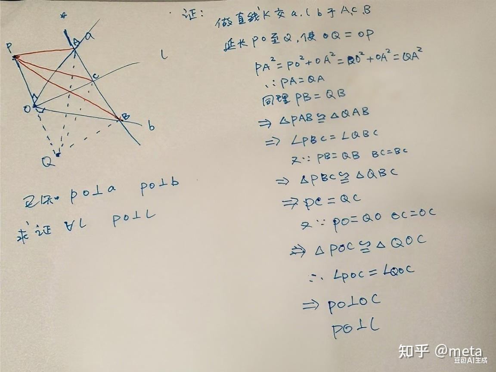
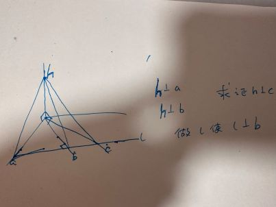
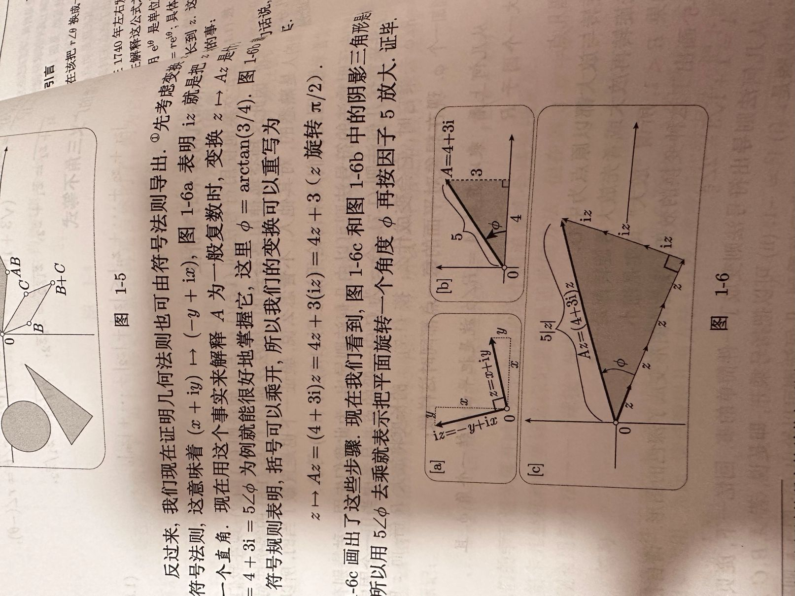

## 问题： 数学？是"慢"学好？还是"快"学好？

当今的高中，学习已经从研究变成了拿分，老师都在讲如何拿高分，如何高效快速的做题，掌握技巧，累计试卷。在我看来用题海战术拿下的高分不是真的高分。

可能在高中时代，我们对于数学都是模棱两可的状态，听懂了但又好像没有听懂，让我给别人讲题也是生搬硬套，老师怎么讲我怎么讲，甚至连公式怎么来的都不知道。在我接触的数学老师中，没有老师会一节课讲十道不同类型的经典题，他们只会囫囵吞枣的告诉我们拿分点，以此快速高效的刷题。假期的试题多到做不完，课间趴着的时间被压缩，我不理解为什么要求浅不求深。

我理想的上课模式是讲一道题，衍生出多道同类型但是知识点又有些变化的题型，这样既可以满足校领导要求的高效刷题，也可以分模块，分区域的讲。让学生深刻的记住那些知识点从哪里来，怎么用。并不是让学生生搬课本上的总结来做题。

对于数学的学习，我认为可以本末倒置，我们拿到一道题目，是我们不会的，我们就要研究这道题怎么来的，从浅方面到深方面的过度，这样我们比提前记忆知识点强的太多，一看到知识点就想到了给你启蒙的题目，让我们对信息的处理有了更深一步的理解。

所以，你更赞同哪一种学习模式呢，是更高效？还是更深彻？

---
## 回答

**数学究竟是“慢”学好，还是“快”学好？**

同学，不绕弯子，直接给你结论：

> **你所追求的“慢”和“深彻”，恰恰是数学学习中最“快”的路。你身边那种看似“快”的刷题模式，才是效率最低的重复劳动。**

我知道你会觉得这很反常识，因为整个环境都在逼你快点、再快点。但请给我一点时间，我用两个你课本上就有的例子，让你亲眼看到，**一次深彻的理解，胜过一百次机械重复。**

---

### 一、“快”与“慢”的本质区别

你讨厌的“快”模式，是把数学当成一套 **“操作说明书”** 。记住题型-套用技巧-得出答案，全程不需要知道“为什么”。这就像背下了做饭的步骤，却不懂火候和食材，换个灶台就不会做饭了。

你追求的“深彻”模式，是把数学当作 **“思维构造过程”** 。每个定理从哪里来、为什么对、它与其它知识有何血脉联系，都弄得清清楚楚。这样的知识是活的、有根的，可以生长出无穷的解题能力。

这两种模式，在一个定理的学习上，体现出天壤之别。

---

### 二、第一个例子：线面垂直判定——凭什么“两条相交线”就够？

这是立体几何的第一个“大道理”。几乎所有学生都只是记住结论，然后疯狂刷题。但你是否曾有过这个挥之不去的疑问：
*“为什么一条直线垂直于平面内两条相交线，就一定能垂直于平面内所有直线？一条不够？相交是什么意思？”*

**“快”法：** “背下来，用这个定理，下面做十道题。”
**“慢”法：** 我们花一节课，用3种方法彻底证明它，并打通它们的任督二脉。

**证法一：对称构造与三角形全等（最纯粹的几何直觉）**

**证法二：纯粹的边长关系（勾股定理的直接力量）**

垂直怎么证明，等价于勾股定理，转换为长度关系来证明，证明留给各位

**证法三：现代代数的威力——空间向量**
1. **转化语言**：设 $l$ 的方向向量为 $\vec{v}$，平面内两条相交线的方向向量为 $\vec{a}, \vec{b}$。那么平面内任意一条线的方向向量 $\vec{p}$，都可以由基底 $\vec{a}, \vec{b}$ 线性表示为 $\vec{p}=x\vec{a}+y\vec{b}$。
2. **瞬间得证**：已知 $\vec{v} \cdot \vec{a}=0, \vec{v} \cdot \vec{b}=0$，则 $\vec{v} \cdot \vec{p} = x(\vec{v}\cdot\vec{a})+y(\vec{v}\cdot\vec{b})=0$，故 $l \perp p$。

**打通联系——点积为零，背后站着勾股定理**
慢下来，我们会追问最关键的一个问题：**“为什么向量点积为0就算垂直？这是规定的吗？”**
不！点积为零，就是勾股定理的代数化身。向量 $\vec{v}$ 和 $\vec{p}$ 垂直的几何定义正是 $|\vec{v}|^2+|\vec{p}|^2=|\vec{v}-\vec{p}|^2$，你把它展开，恰好等价于 $\vec{v}\cdot\vec{p}=0$。

你看，证法二的勾股几何，证法三的向量代数，根本上是一回事。而且，证法三几乎**一秒钟**就完成了证明，它的力量源泉是什么？就是我接下来要说的——**线性性**。

---

### 三、第二个例子：复数乘法——为什么是“旋转+缩放”？

课本上用三角公式证明“模相乘、辐角相加”，你只觉得是代数推导的巧合，看不见几何意义。

证明来自《复分析：可视化方法》一书

**“深彻”法让你亲眼看见：**
我们来理解 $(4+3i) \times z$ 的几何效果。
1. **奠基**：任何数乘以 $i$，就是**逆时针旋转90°**（因为 $1\times i=i$，$i \times i=-1$）。
2. **拆分**：$(4+3i)z = 4z + 3(iz)$。这是两个向量的和：一个沿原方向拉伸4倍，一个沿垂直方向拉伸3倍。
3. **几何洞察**：这两个向量互相垂直，构成一个直角三角形，直角边长为 $4|z|$ 和 $3|z|$，斜边就是最终结果，长度为 $5|z|$。这个三角形和复数 $4+3i$ 自身构成的三角形**相似**！
4. **一眼看穿**：相似直接告诉你，斜边相对于 $z$ 的旋转角就是 $4+3i$ 自身的辐角 $\phi$，长度放大了5倍。**没有用到任何三角公式，全靠相似三角形。**

这个方法的灵魂，同样是**线性性**：我们通过把乘法拆成“$1$ 和 $i$ 这个基底”上的线性组合，再利用已知的“乘以 $i$ 旋转90°”这个基底上的效果，就轻松捕获了整个变换的几何本质。

---

### 四、那个统摄一切的思想：线性性

现在，把你深度学完的这两个例子放在一起，你会发现一个惊人的秘密：

*   **线面垂直**：因为平面内任意向量 $\vec{p}$ 可以写成基底的线性组合，我们只需知道 $\vec{v}$ 在**两个基向量**上点积为0，就能推演出它在**所有向量**上点积为0。**“两条相交线”的秘密，就是“基底”的秘密。**
*   **复数乘法**：因为任意复数乘法可以拆成在基底 $\{1,i\}$ 上的线性组合，我们只需知道“乘以 $i$ 是旋转90°”这一基底上的作用，就能看见乘以任意复数是“旋转+缩放”。

**线性性的核心思想是：对于线性运算，你只要知道它在基底上怎么作用，就能知道它在整个空间上怎么作用。**

“快”模式教给你的是一盘散沙的孤立技巧。而“深彻”模式，让你用“线性性”一根线，把立体几何、向量、复数、甚至未来的线性代数全部串了起来。这种知识网络一旦形成，你学习新东西的速度是指数级上升的。这才是真正可怕的效率。

---

### 五、所以，你可以怎么做？

你也许会说：“老师不这么讲，高考压力又大，我能怎么办？”

我的建议是：**拿回学习的主动权，做知识的“研究者”而非“背诵者”。**

1. **为每一个定理寻找“启蒙的题目”**。比如，学到复数乘法，就去用相似三角形证一遍；学到线面垂直，就去把向量法和勾股法亲手推演一遍。
2. **追问“为什么”直到触及公理或直觉**。公式记不住？那是因为你没看见它的样子。想方设法去“看见”它。
3. **主动建立联系**。学完一个章节，问自己：这里的核心思想是什么？它和以前学过的什么有关？这个思想还能用来解释什么？

你现在的痛苦，源于你敏锐地感觉到了那种浅尝辄止的学习方式，正在把你变成没有灵魂的做题机器。但你的思考和质疑，本身就是跳出这个困境的最宝贵能力。

请坚持“慢”下来。你用一堂课的深彻，换回来的将是整个高中后期乃至终生的思维自由。**真正的高分，从来都是深彻理解的自然产物，而不是题海战术的偶然所得。**

你已经在正确的路上了，坚定地走下去。