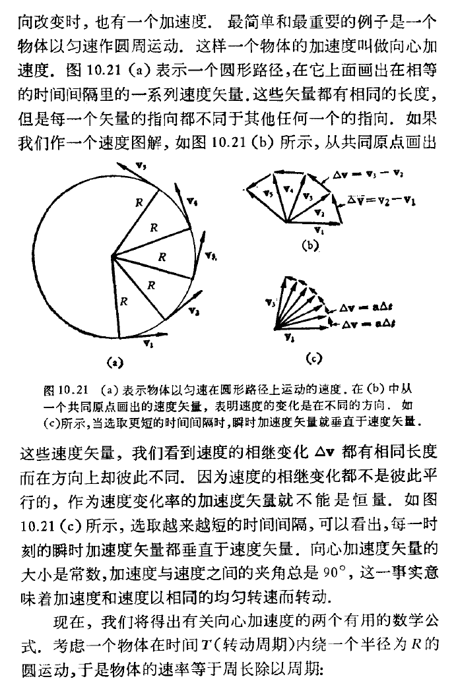
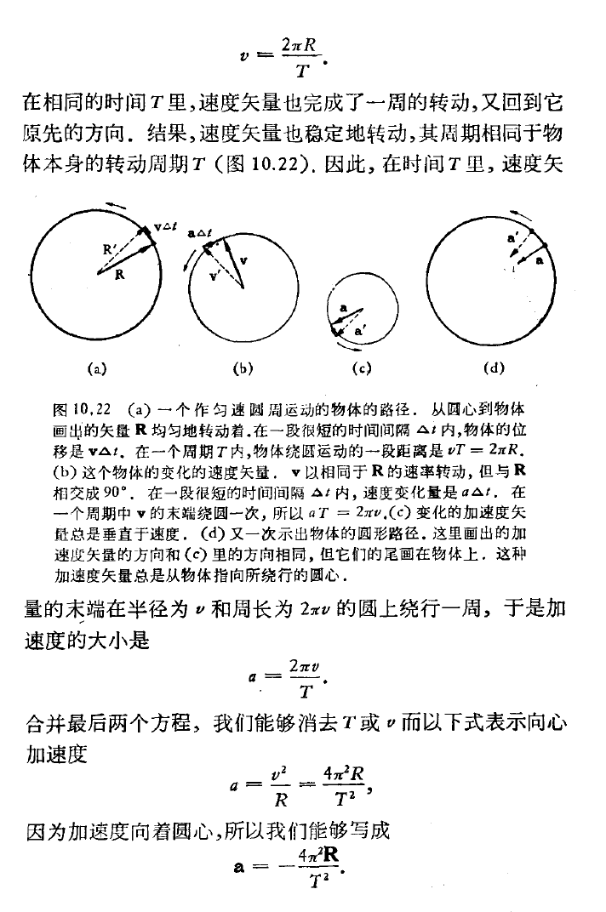

## 匀速圆周运动的加速度

匀速圆周运动的向心加速度公式 $a = \frac{v^2}{r}$ 是经典力学中最优美的结论之一。下面为您提供三种不同的推导方法，其中第一种详细介绍了牛顿最初的推导方法及其历史背景，后两种分别是经典的高中几何法和现代的微积分法。

---

### 方法一：牛顿的“切线跌落”法（历史与几何动力学结合）

#### 📜 历史背景
在物理学史上，向心加速度公式的首次发表其实归功于荷兰物理学家**克里斯蒂安·惠更斯**（1673年，《摆钟论》）。然而，**艾萨克·牛顿**在1665-1666年（因黑死病在家乡躲避瘟疫期间）就已经独立推导出了这个结果。
牛顿在思考月球为什么不会飞离地球时，将月球的运动看作是“不断向地心自由落体”的过程。他在后来的《自然哲学的数学原理》（1687年）中，使用了极其精妙的极限几何方法来证明这一点。

#### 📐 推导过程
牛顿的核心思想是：**如果物体不受力，它将沿切线做匀速直线运动；因为它受到了指向圆心的力，它会在相同时间内从切线“跌落”到圆弧上。**

1. **设定模型**：
   假设质点以速率 $v$ 在半径为 $r$ 的圆上运动。在一段极短的时间 $\Delta t$ 内，如果它不受力，它将沿切线运动到 $A$ 点，位移 $s = v \Delta t$。
   但实际上，它沿着圆弧运动到了 $B$ 点。
   由于 $\Delta t$ 极短，切线距离 $s$ 约等于圆弧的长度。

2. **几何关系**：
   设圆的圆心为 $O$。从切线上的 $A$ 点向圆心 $O$ 连线，交圆周于 $B$ 点。线段 $AB$ 的长度就是质点在 $\Delta t$ 时间内向圆心“跌落”的距离，设为 $\Delta x$。
   根据几何学中的**割线定理**（或勾股定理在极小三角形中的近似）：
   延长 $AO$ 交圆于另一端，整条割线长为 $2r + \Delta x$（实际上当 $\Delta x$ 极小且垂直于切线时，可用近似模型）。
   更严谨的几何构造是：设切线段为 $s$，圆的直径为 $2r$。根据**切割线定理**：
   $s^2 = \Delta x \cdot (2r + \Delta x)$
   
3. **极限近似**：
   因为时间 $\Delta t$ 趋近于 0，所以“跌落”的距离 $\Delta x$ 是一个极小量。因此 $(\Delta x)^2$ 是高阶无穷小，可以忽略不计。
   等式简化为：
   $s^2 \approx 2r \cdot \Delta x$
   所以向心跌落距离： $\Delta x = \frac{s^2}{2r}$

4. **代入运动学公式**：
   将 $s = v \Delta t$ 代入上式：
   $\Delta x = \frac{(v \Delta t)^2}{2r} = \frac{v^2}{2r} \Delta t^2$
   由于在这段极短的时间内，向圆心的运动可以看作是初速度为0的匀加速直线运动（类比自由落体），根据位移公式 $\Delta x = \frac{1}{2} a \Delta t^2$。

5. **得出结论**：
   对比两个 $\Delta x$ 的表达式：
   $\frac{1}{2} a \Delta t^2 = \frac{v^2}{2r} \Delta t^2$
   消去 $\frac{1}{2} \Delta t^2$，立刻得到向心加速度：
   $$a = \frac{v^2}{r}$$

*(注：牛顿在手稿中就是通过这种比较“切线偏离量”与“抛体运动下落量”的方法，完美统一了天体运动与地面上的重力现象。)*

---

### 方法二：相似三角形法（矢量几何法）

这是目前大多数高中物理教材采用的标准推导方法，它直观地展现了速度矢量的变化。

#### 📐 推导过程
1. **位置矢量与速度矢量**：
   质点在圆周上从点 $P_1$ 运动到距离极近的点 $P_2$，经历时间 $\Delta t$。
   对应位置矢量为 $\vec{r}_1$ 和 $\vec{r}_2$，大小均为 $r$。转过的角度为 $\Delta \theta$。
   对应的速度矢量为 $\vec{v}_1$ 和 $\vec{v}_2$，大小均为 $v$。由于速度总是垂直于位置矢量，所以 $\vec{v}_1$ 和 $\vec{v}_2$ 之间的夹角也是 $\Delta \theta$。

2. **构建速度三角形**：
   将 $\vec{v}_1$ 和 $\vec{v}_2$ 的起点平移到同一点，它们的变化量 $\Delta \vec{v} = \vec{v}_2 - \vec{v}_1$。
   这样形成了一个速度矢量三角形，其两边长为 $v, v$，底边为 $|\Delta \vec{v}|$，顶角为 $\Delta \theta$。

3. **利用相似三角形**：
   位置矢量三角形（边长 $r, r$，底边位移 $|\Delta \vec{r}|$）与速度矢量三角形（边长 $v, v$，底边 $|\Delta \vec{v}|$）都是等腰三角形，且顶角均为 $\Delta \theta$。
   因此，这两个三角形**相似**：
   $\frac{|\Delta \vec{v}|}{v} = \frac{|\Delta \vec{r}|}{r}$

4. **取极限求解**：
   对上式两边同除以 $\Delta t$：
   $\frac{|\Delta \vec{v}|}{\Delta t} = \frac{v}{r} \cdot \frac{|\Delta \vec{r}|}{\Delta t}$
   当 $\Delta t \to 0$ 时，$\frac{|\Delta \vec{v}|}{\Delta t}$ 就是加速度 $a$的大小，而 $\frac{|\Delta \vec{r}|}{\Delta t}$ 就是瞬时速度 $v$ 的大小。
   代入得到：
   $a = \frac{v}{r} \cdot v = \frac{v^2}{r}$
   
5. **方向判定**：
   当 $\Delta t \to 0$ 时，$\Delta \theta \to 0$，等腰三角形的底角趋近于 $90^{\circ}$。即 $\Delta \vec{v}$ 的方向垂直于切线速度 $\vec{v}$，指向圆心。

---

## 方法三: 来自 PSSC 物理

### 方法四：现代微积分法（参数方程求导法）

这是大学普通物理及高等数学中最严谨、最简洁的方法，直接利用矢量函数的导数。

#### 📐 推导过程
1. **建立坐标系**：
   以圆心为原点建立直角坐标系。设质点以角速度 $\omega$ 作匀速圆周运动（其中 $\omega = \frac{v}{r}$）。
   在 $t$ 时刻，质点的位置矢量参数方程可以写为：
   $\vec{r}(t) = r \cos(\omega t) \hat{i} + r \sin(\omega t) \hat{j}$
   （其中 $\hat{i}, \hat{j}$ 分别是 x 轴和 y 轴的单位矢量）。

2. **对时间求一阶导数得到速度**：
   速度矢量 $\vec{v}(t) = \frac{d\vec{r}}{dt}$。
   根据链式法则对三角函数求导：
   $\vec{v}(t) = -r\omega \sin(\omega t) \hat{i} + r\omega \cos(\omega t) \hat{j}$
   （注意：由此可验证速率 $v = |\vec{v}| = \sqrt{(-r\omega\sin\omega t)^2 + (r\omega\cos\omega t)^2} = r\omega$）。

3. **对时间求二阶导数得到加速度**：
   加速度矢量 $\vec{a}(t) = \frac{d\vec{v}}{dt}$。
   再次求导：
   $\vec{a}(t) = -r\omega^2 \cos(\omega t) \hat{i} - r\omega^2 \sin(\omega t) \hat{j}$

4. **提取公因式并得出结论**：
   提取出 $-\omega^2$：
   $\vec{a}(t) = -\omega^2 [r \cos(\omega t) \hat{i} + r \sin(\omega t) \hat{j}]$
   括号里的部分正好就是位置矢量 $\vec{r}(t)$！
   所以：
   $$\vec{a}(t) = -\omega^2 \vec{r}(t)$$

5. **物理意义解析**：
   * **大小**：$|\vec{a}| = \omega^2 r$。将 $\omega = \frac{v}{r}$ 代入，得到 $a = (\frac{v}{r})^2 \cdot r = \frac{v^2}{r}$。
   * **方向**：公式中的**负号**表明，加速度矢量的方向与位置矢量 $\vec{r}(t)$ 的方向完全相反。因为位置矢量是从圆心指向质点，所以加速度方向必然是**从质点指向圆心**（这就是“向心”的数学证明）。

---

### 方法五：复数法（欧拉公式的魔法）
这是电子工程和理论物理中最偏爱的方法。它利用复平面来表示二维平面，通过虚数单位 $i$ 的性质，将繁琐的矢量方向变化转化为极其优雅的代数运算。

1. **建立复平面模型**：
   将圆心放在复平面的原点。质点在半径为 $r$ 的圆上以角速度 $\omega$ 匀速运动。
   根据**欧拉公式**，质点在时刻 $t$ 的位置可以写成一个复数 $z$：
   $$z = r e^{i\omega t}$$
   （这里的 $e^{i\omega t} = \cos(\omega t) + i \sin(\omega t)$，正好对应二维平面的横纵坐标）。

2. **求一阶导数（速度）**：
   对时间 $t$ 求导，利用指数函数的求导法则：
   $$v = \frac{dz}{dt} = i \omega r e^{i\omega t} = i \omega z$$
   **物理意义**：乘以虚数 $i$ 在复平面上等价于**逆时针旋转 90 度**。这不仅得出了速度的大小 $v = \omega r$，还完美证明了**速度方向垂直于位置矢量（即沿切线方向）**。

3. **求二阶导数（加速度）**：
   再对时间 $t$ 求导：
   $$a = \frac{dv}{dt} = i^2 \omega^2 r e^{i\omega t}$$
   因为 $i^2 = -1$，所以：
   $$a = -\omega^2 (r e^{i\omega t}) = -\omega^2 z$$
   **物理意义**：负号（也就是旋转 180 度）表明，加速度方向与位置矢量 $z$ 的方向完全相反——即**指向圆心**。
   大小就是 $\omega^2 r$，代入 $\omega = \frac{v}{r}$，即得 $a = \frac{v^2}{r}$。
